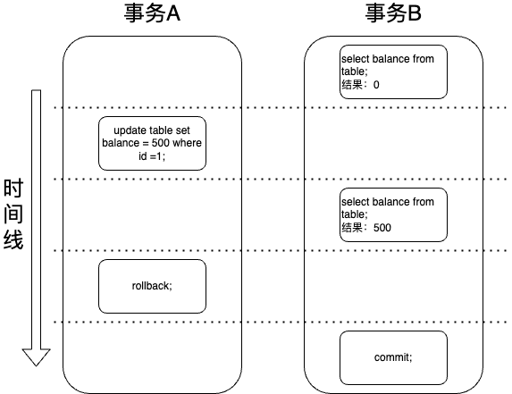
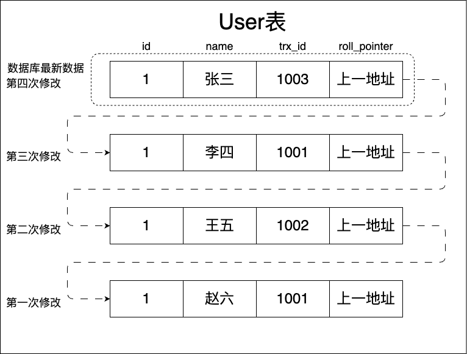
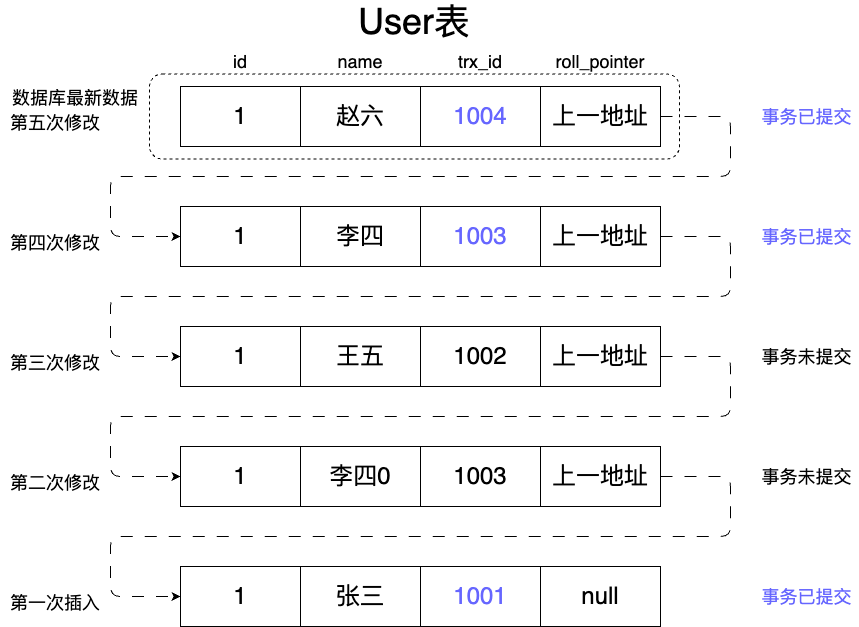
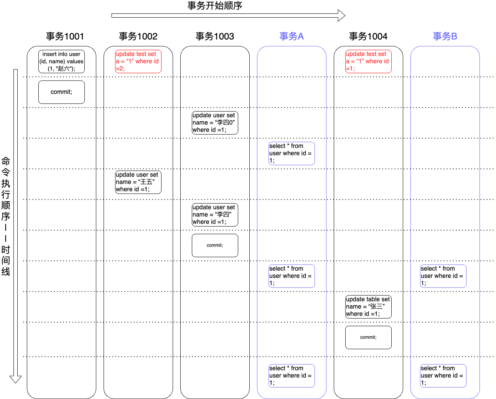
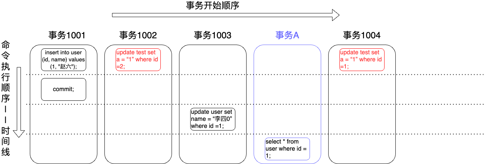
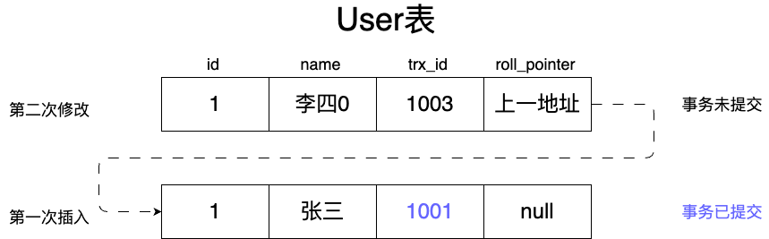
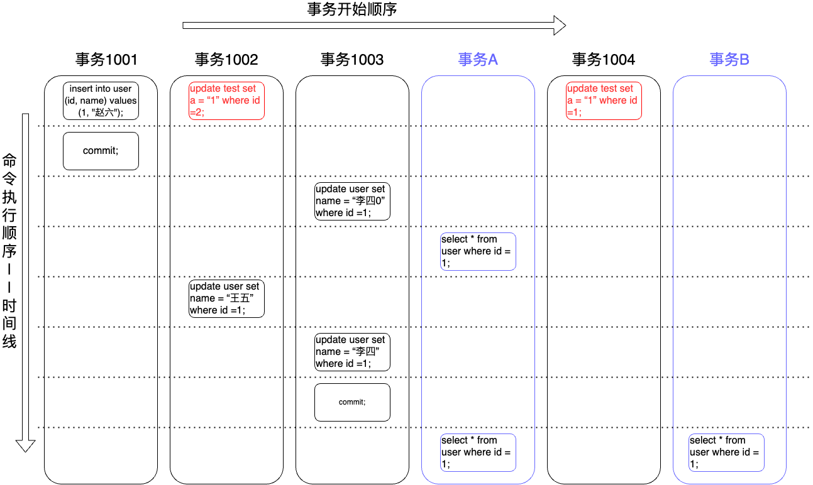
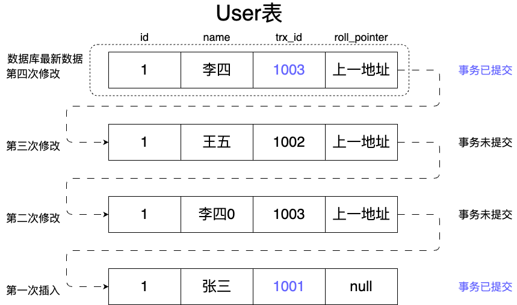

本文深入解析了多版本并发控制（MVCC，Multi-Version Concurrency Control）机制，探讨了其在提升数据库并发性能方面的重要作用。首先，文章介绍了MVCC的基本概念，包括它是如何通过保留数据的多个版本来支持并发读取而不需加锁的。并通过具体例子展示了MVCC如何有效防止常见的并发问题，如脏读、不可重复读和幻读。

<!-- more -->

# MVCC机制解析：提升数据库并发性能的关键

MVCC（Multi-Version Concurrency Control） `多版本并发控制` 。

MVCC只在事务隔离级别为读已提交(Read Committed)和可重复读(Repeated Read)下生效。

## MVCC是做什么用的

MVCC是为了处理 `可重复读` 和 `读已提交` 事务隔离级别下，在同一事务里，多次执行同一SQL查询语句，不会因为其他事务的横插一脚，对数据进行修改后，导致最终得到的结果不一致。如下图所示，事务B的两次查询得到的结果不一样。

## MVCC是怎么实现的

在 `串行读` 这一事务隔离级别里面，为了保证较高的事务隔离性，采用了将所有的操作加锁互斥，将事务的执行变为顺序执行，相当于单线程的方式，以达到其高隔离性。

而mysql在 `可重复读` 和 `已提交读` 事务隔离级别下，他的隔离性是借助MVCC机制来保证的，MVCC机制呢，也不是通过加锁互斥来保证隔离性的，是通过 `Undo日志版本链` 和 `Read View机制` 实现的。避免了频繁的加锁互斥阻塞。

### Undo日志版本链

**Undo日志是什么？**

undo日志是回滚日志，在mysql对某一数据进行修改更新时，会将其更新前的数据保存到undo回滚日志里，等当事务执行失败时，用来进行数据回滚的。

**而什么是undo日志版本链呢？**

就是一行数据被多个事务依次修改后，这条数据就会有很多条undo日志，这些undo日志就会通过一个 `roll_pointer` 字段进行串联起来，会形成这条数据的历史记录版本链，这个就是undo日志版本链。

 **`roll_pointer` 字段哪里来的呢？**

在mysql数据库里，数据表都会有两个隐藏的字段属性， `trx_id事务id` 和 `roll_pointer回滚指针` ，其中 `trx_id` 是用来记录操作数据的，而 `roll_pointer` 则是用来记录指向上一次修改的日志地址。

> 注意：begin/start transaction这个开始/启动事务命令，并不是一个事务的起点， 而是在执行到第一条更新update、删除delete、插入insert语句时，事务才真正的启动，才会有真正的事务id。
>
> 后生成的trx_id要比先生成的trx_id大。
>
> 只有InnoDB数据引擎才支持事务。

下图中，每一条数据都是一个undo回滚日志，通过roll_pointer串联起来后，就是undo日志版本链了。

> 如果第二次修改操作将name改为了 `王五` ，又因为某些原因需要进行数据回滚，就要拿到roll_pointer里记录的上一次，也就是第一次修改操作的undo回滚日志地址，将name回滚为 `赵六` 。

### Read View机制

在可重复读隔离级别下，一个事务在开始时，执行任何的查询SQL脚本，都会生成一个属于当前事务自己的 `Read View一致性视图` ，这个视图在这个事务结束之间，都是保持不变的（除非在本事务里面自己执行了更新操作）。

> 如果事务隔离级别是读已提交，则 `Read View一致性视图` 是在每次执行查询SQL脚本时，都会重新生成，与可重复读隔离级别的在同一事务里保持不变不同。

**这个视图是什么呢？**

这个视图是由执行查询SQL脚本这一时刻，所有还未提交的事务id构建而成的数组，和此时存在最大的一个事务id共同构建而成。

#### **示意图一**

#### **示意图二**

结合上面两图分析可知，

**事务A** 第一次执行查询语句时刻，所生成的ReadView的构成为 **{[1002,1003,1004], 1004}** ，其中[1002,1003,1004]为未提交的事务id（min_id=1002，min_id最小事务id是从未提交事务id里获取的），1004为当前最大的事务id（max_id=1004）。

**事务A** 第二次、三次执行查询语句时刻，其ReadView的依旧为 **{[1002,1003,1004], 1004}** 。

**事务B** 第一次执行查询语句时刻，所生成的ReadView的构成为 **{[1002,1004], 1004}** ，其中[1002,1004]为未提交的事务id（min_id=1002），1004为当前最大的事务id（max_id=1004）。

**事务B** 第二次执行查询语句时刻，所生成的ReadView的依旧为 **{[1002,1004], 1004}** 。

根据事务A和事务B的ReadView可以得出一个相同的工具图（用来判断某事务的某一次数据更新，是否对select是可见的）

> 事务里的select语句查询结果都是需要从undo日志版本链最新数据开始，逐条与本事务的ReadView进行比对，判断应该获取到哪一日志版本的数据为select语句的查询结果。

#### **示意图三**

> 比对规则
>
> - 如果比较的undo日志的 **trx_id小于min_id** ，则表示这个版本事务是已经提交的，代表本次select这一事务可以查到这个数据。
>
> - 如果比较的undo日志的 **trx_id大于max_id** ，则表示这个版本事务是在本次select这一事务后面新启动的，这种数据肯定是不可被查询到的。
>
> - 如果比较的undo日志的 **trx_id大于等于min_id** ，且 **trx_id小于等于max_id** ，则再判断 trx_id是否是在未提交事务id数组里。
>   - 在未提交事务id数组里，则表示这个版本数据是由未提交的事务所生成的，这种数据不可被查询到（除非这个未提交的事务就是自己）。
>   - 不在未提交事务id数组里，则表示这个版本数据是由已经提交的事务所生成的，这种数据可以被查询到。

### 案例一

**那么事务A第一条select语句查询脚本执行时，获取到的name是什么呢？**

先说结果，查询到的name为赵六。

事务A执行第一条select语句时，他的SQL执行顺序，和SQL查询脚本执行时拿到的日志版本链及判断示意图如下。

上面在示意图二里也说了，事务A的第一次执行查询语句时刻时，其ReadView为 **{[1002,1003,1004], 1004}** 。

比较步骤如下

**第一次：** 事务A从undo日志版本链拿到最后一次更新记录（第二次修改记录），得到trx_id为1003，然后对照着上面的 **判断工具图** 进行比较，大于min_id，小于max_id，所以1003事务id属于是 **第二部分** ，且1003这一事务id处于还未提交的事务id构建而成的数组里（未提交的事务id数组[1002,1003,1004]），所以这个事务进行的更新数据，是不可被查询到的。

于是根据roll_pinter回滚指针（上一版本数据的地址）找到上一个版本数据。

**第二次：** 事务A从undo日志版本链拿到第二条日志记录（第一次插入记录），得到trx_id为1001，然后同样对照着上面的 **判断工具图** 进行比较，发现小于min_id的1002，所以1001事务id属于是 **第一部分** ，是已经提交了事务的，他更新的数据就属于可以被查询到，于是此时查询到的结果name为张三。

### 案例二

**那么事务A第二条select语句查询脚本执行时，获取到的name是什么呢？**

先说结果，查询到的name依旧为赵六。

事务A执行第二条select语句时，他的SQL执行顺序，和SQL查询脚本执行时拿到的日志版本链及判断示意图如下。

上面在示意图二里也说了，事务A的第二次和第三次执行查询语句时刻时，其ReadView依旧为 **{[1002,1003,1004], 1004}** 。

比较步骤如下

**第一次：** 事务A从undo日志版本链拿到最后一次更新记录（第四次修改记录），得到trx_id为1003，然后对照着上面的 **判断工具图** 进行比较，大于min_id，小于max_id，所以1003事务id属于是 **第二部分** ，继续判断得知，1003这一事务id处于还未提交的事务id构建而成的数组里（未提交的事务id数组[1002,1003,1004]）（即便此时事务1003已经提交了，但是只要在事务A第一次执行查询语句时，这个事务没有提交，那他在事务A里就一直被标记的是未提交，否则就会出现 [不可重复读](为何MySQL选择B+树作为索引结构.md) 问题），所以这个事务进行的更新数据，是不可被查询到的。

于是根据roll_pinter回滚指针（上一版本数据的地址）找到上一个版本数据。

**第二次：** 事务A从undo日志版本链拿到第二条日志记录（第三次修改记录），得到trx_id为1002，然后同样对照着上面的 **判断工具图** 进行比较，发现等于min_id的1002，所以1002事务id属于是 **第二部分** ，继续判断得知，1002这一事务id处于还未提交的事务id构建而成的数组里（未提交的事务id数组[1002,1003,1004]），所以这个事务进行的更新数据，是不可被查询到的。

于是根据roll_pinter回滚指针（上一版本数据的地址）找到上一个版本数据。

**第三次：** 事务A从undo日志版本链拿到最后一次更新记录（第二次修改记录），得到trx_id为1003，然后对照着上面的 **判断工具图** 进行比较，大于min_id，小于max_id，所以1003事务id属于是 **第二部分** ，且1003这一事务id处于还未提交的事务id构建而成的数组里（未提交的事务id数组[1002,1003,1004]），所以这个事务进行的更新数据，是不可被查询到的。

于是根据roll_pinter回滚指针（上一版本数据的地址）找到上一个版本数据。

**第四次：** 事务A从undo日志版本链拿到第二条日志记录（第一次插入记录），得到trx_id为1001，然后同样对照着上面的 **判断工具图** 进行比较，发现小于min_id的1002，所以1001事务id属于是 **第一部分** ，是已经提交了事务的，他更新的数据就属于可以被查询到，于是此时查询到的结果name为张三。

### 案例三

**那么事务B第一条select语句查询脚本执行时，获取到的name是什么呢？**

先说结果，查询到的name为李四。

为什么事务B的一条查询语句和事务A的第二条查询语句是同时执行的，但是结果不一样呢？可以详细看看下面对事务的比较步骤。

**事务B** 第一次执行查询语句时刻，其所生成的ReadView的构成为 **{[1002,1004], 1004}** ，其中[1002,1004]为未提交的事务id（min_id=1002），1004为当前最大的事务id（max_id=1004）。

事务B执行第一条select语句时，他的SQL执行顺序，和SQL查询脚本执行时拿到的日志版本链及判断示意图同案例二里的一样。

比较步骤如下

**第一次：** 事务B从undo日志版本链拿到最后一次更新记录（第四次修改记录），得到trx_id为1003，然后对照着上面的 **案例二的判断工具图** 进行比较，大于min_id，小于max_id，所以1003事务id属于是 **第二部分** ，继续判断得知，1003这一事务id **不处于** 还未提交的事务id构建而成的数组里（未提交的事务id数组[1002,1004]），所以表示这个事务已经提交了，这个事务所更新的数据版本可以被查询到，查询结果就是name为李四。

### 案例四

**事务A第三条select语句查询脚本执行时，获取到的name是什么呢？**

先说结果，查询到的name还是赵六。

事务A执行第三条select语句时，他的SQL执行顺序，和SQL查询脚本执行时拿到的日志版本链及判断示意图如下。

上面在示意图二里也说了，事务A的第二次和第三次执行查询语句时刻时，其ReadView依旧为 **{[1002,1003,1004], 1004}** 。

比较步骤如下

**第一次：** 事务A从undo日志版本链拿到最后一次更新记录（第五次修改记录），得到trx_id为1004，然后对照着上面的 **判断工具图** 进行比较，大于min_id，小于 **等于** max_id，所以1004事务id属于是 **第二部分** ，且1004这一事务id **不处于** 还未提交的事务id构建而成的数组里（未提交的事务id数组[1002,1003,1004]），所以这个事务进行的更新数据，是不可被查询到的。

于是根据roll_pinter回滚指针（上一版本数据的地址）找到上一个版本数据。

**第二次：** 比较过程和示例二里的第一次比较操作过程一样。

于是根据roll_pinter回滚指针（上一版本数据的地址）找到上一个版本数据。

**第三次：** 比较过程和示例二里的第二次比较操作过程一样。

于是根据roll_pinter回滚指针（上一版本数据的地址）找到上一个版本数据。

**第四次：** 比较过程和示例二里的第三次比较操作过程一样。

于是根据roll_pinter回滚指针（上一版本数据的地址）找到上一个版本数据。

**第五次：** 比较过程和示例二里的第四次比较操作过程一样。得到查询结果name为张三。

### 案例五

**那么事务B第二条select语句查询脚本执行时，获取到的name是什么呢？**

先说结果，查询到的name为李四。

**事务B** 第二次执行查询语句时刻，其所生成的ReadView的依旧为 **{[1002,1004], 1004}** 。和其第一次执行查询语句时刻一样。

事务B执行第三条select语句时，他的SQL执行顺序图，和SQL查询脚本执行时拿到的日志版本链和上面案例三的一样。

虽然ReadView和案例三的不同，为 **{[1002,1004], 1004}** ，但是其形成的判断图还是一样的。

比较步骤如下

**第一次：** 事务B从undo日志版本链拿到最后一次更新记录（第五次修改记录），得到trx_id为1004，然后对照着上面的 **判断工具图** 进行比较，大于min_id，小于 **等于** max_id，所以1004事务id属于是 **第二部分** ，且1004这一事务id **不处于** 还未提交的事务id构建而成的数组里（未提交的事务id数组[1002,1004]）（即便此时事务1004已经提交了，但是只要在事务B第一次执行查询语句时，这个事务没有提交，那他在事务B里就一直被标记的是未提交，否则就会出现 [不可重复读](为何MySQL选择B+树作为索引结构.md) 问题），所以这个事务进行的更新数据，是不可被查询到的。（和上面案例二的第一次比较一样）

第二次：事务B从undo日志版本链拿到第二条日志记录（第四次修改记录），得到trx_id为1003，然后对照着上面的 **案例二的判断工具图** 进行比较，大于min_id，小于max_id，所以1003事务id属于是 **第二部分** ，继续判断得知，1003这一事务id **不处于** 还未提交的事务id构建而成的数组里（未提交的事务id数组[1002,1004]），所以表示这个事务已经提交了，这个事务所更新的数据版本可以被查询到，查询结果就是name为李四。

## 读已提交隔离级别又是怎么比较的

**读已提交** （已提交读）事务隔离级别的undo日志版本链和 **可重复读** 是一样的，Read View的生成规则就不同了， <u>读已提交的 `Read View一致性视图` 是在每次执行查询SQL脚本时，都会重新生成</u> ，与可重复读隔离级别的在同一事务里保持不变的定义不同。

这也就导致每次执行查询脚本时，都会重新构建 **还未提交的事务id数组** ，所以只要其他事务在本事务执行这一条查询脚本之前，更新数据并提交了，那他的更新数据就可以被本事务的这一次查询操作查询到。

其他的比对规则还是和 **可重复读** 事务隔离级别一样，仅仅是ReadView在每次查询时需要重新生成。

可以理解为 **读已提交** 事务隔离，只会读到最后一次提交了更新操作事务的数据。

