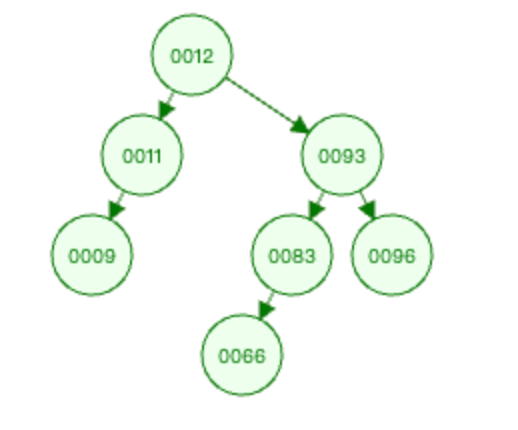
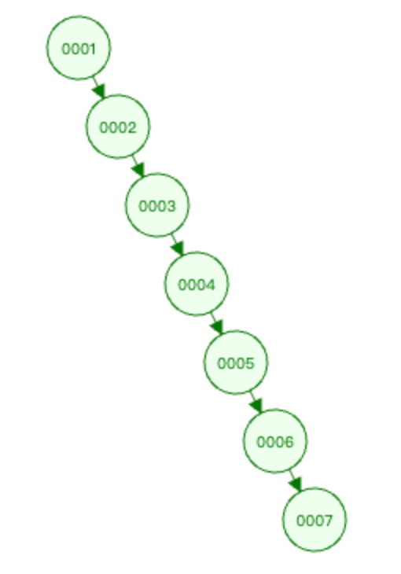
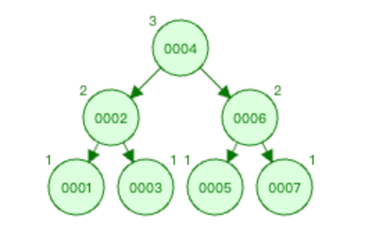
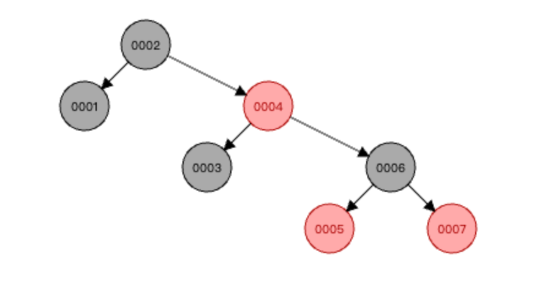
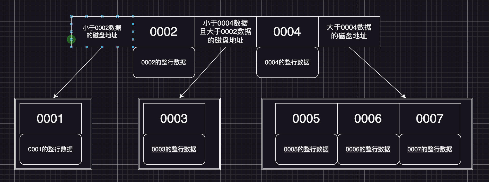
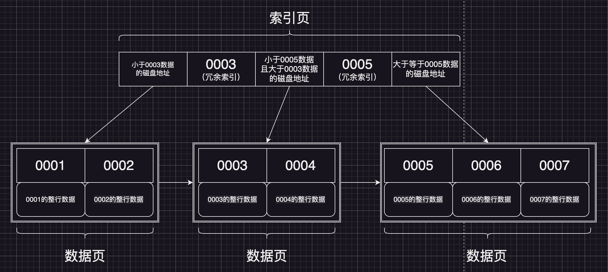

我们知道MySQL数据库InnoDB引擎索引的数据结构是B+树，那他为什么不用红黑树，不用B树呢？用B+树的优点在哪里？解决了些什么问题？

下面将以这几个疑问点为中心记录一下MySQL选用B+树的原因。

<!-- more -->

# 揭秘InnoDB：为何MySQL选择B+树作为索引结构

案例数据：表a有如下两个字段，且两个字段数据如下

| 字段a(主键) | 1    | 2    | 3    | 4    | 5    | 6    | 7    |
| ----------- | ---- | ---- | ---- | ---- | ---- | ---- | ---- |
| 字段b       | 12   | 93   | 11   | 83   | 66   | 96   | 9    |

接下来将以常见的几种数据结构来看看进行比对，为什么MySQL最终使用了B+Tree（B+树）作为索引的数据结构。

索引的数据结构可以有如下几种：二叉树、平衡二叉树、红黑树、Hash表、B-Tree、B+Tree；

## 1. 二叉树（二叉查找树）

如果索引数据结构是二叉树（二叉查找树）（有序的）：

则 `字段b` 的索引结构为

此时如果要查询数据 `83` ,则查询路径为12--93--83，查询的很快，看起来很适合做索引的数据结构。

但是如果给 `字段a` 按照二叉树（二叉查找树）结构排好序，则为

此时如果要查询数据 `7` ，则查询路径为1--2--3--4--5--6--7，将所有数据都遍历了一遍，相当于是一个链表了，查询效率就很低。

所以二叉树（二叉查找树）不适合查询有序数据，所以没有被应用于mysql的索引结构。

## 2. 平衡二叉树

平衡二叉树可以很好的解决二叉查找树遇到有序数据导致成为链表的情况。应为平衡二叉树有自平衡的特性，左右子树其中一边太长了之后，会触发平衡调整操作，进行旋转，保持树的左右子树平衡。

具体的概念和平衡二叉树的平衡调整操作过程可以看 《 [平衡二叉树](../other/structure/平衡二叉树.md) 》 。

那为什么mysql不使用平衡二叉树做索引结构呢？因为平衡二叉树太注重平衡性，需要经常进行平衡调整，操作过于频繁，会影响性能。

## 3. 红黑树

红黑树是一个弱平衡的二叉树，虽然也需要进行旋转操作，但是他不需要去保持整棵树的平衡，每次插入操作最多也只会旋转2次，极大程度减少了平衡调整操作的次数，从而操作性能红黑树比平衡二叉树要高。

而且红黑树和平衡二叉树的查询性能都为O(logn)。

但即使如此，他依旧不适合用当做mysql的索引结构，因为当数据量大了之后，红黑树树的高度是不可控的，树的高度越高，查询比较次数就越多，性能也就越低下。

## 4. B-Tree（B树）

红黑树的高度不可控，于是就出现了B树，B树的每一个节点是一个页，一页有16KB大小，每页里面都放满了索引元素，假如一条数据有5KB大小，那么就是一页里面可以放3个索引元素（B树的索引节点是同时存放整行业务数据的），那么他的示意图如下

所有索引元素不重复，且从左到右是递增排列的。

B树解决了红黑树高度不可控的因素，一个节点一页存储多个索引元素，很大程度上减少了树的高度。但是又因为每个索引元素都是会同时存储整行数据的，所以一页大小16KB，也存不了多少行。所以MySQL也没有使用B树，而是使用了B树的一个变种，B+树。

## 5. B+Tree（B+树）

B+树是B树的变种，非叶子节点，不会再存放索引对应的整行data数据，而是只存储冗余的索引字段，和数据页的地址。

且在B+树中，上层的非叶子节点的索引数据都是 `冗余索引` ，就是最终获取数据是必须要一直查询到叶子节点，才可以获取到（非叶子节点不再存储整行数据）。

> 冗余索引：是从叶子节点里提取出来的索引，就叫冗余索引，提取出来的冗余索引和叶子节点一起组成构建了一个B+树。冗余索引都是每个叶子节点的第一个（一页数据的第一条索引）。
>
> 上图中的0003就是[0003, 0004]叶子节点（也可以理解为一页）里提取的第一个索引数据。0005就是[0005, 0006, 0007]叶子节点里提取的第一个索引数据。

而叶子节点是包含了所有的索引字段的，同时页子节点之间有指针连接，可以提高区间的访问性能。

例如：要查询0004，则先在第一层进行判断，0004>0003且0004<0005，所以就是在0003和0005之间，就拿到对应数据页的磁盘地址，然后就到[0003，0004]这一页的叶子节点里进行查找（用二分查找等算法）就能拿到0004的数据。

使用B+树作为MySQL的索引结构，只需要3层树的高度，就可以存储大概2千万~3千万的数据量。查询数据也只需要进行3次IO查询即可。

> 注意：只有主键索引的叶子节点才会存储整行数据，而非主键索引，其叶子节点存储的数据是主键Id，需要回表才能获取到整行数据。