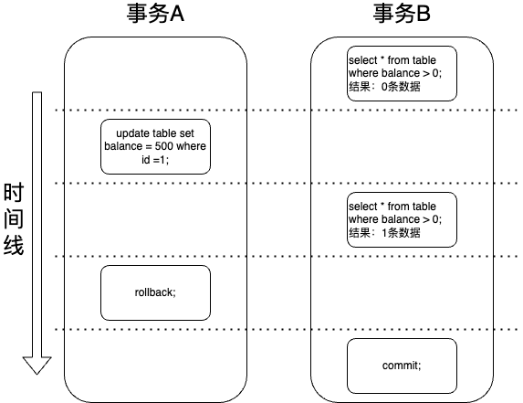

当出现并发请求时，我们的数据库可能会出现多个事务同一时间，对同一条数据进行更新查询等操作，这就有可能会出现脏读、脏写、不可重复读、幻读等并发问题的情况。

<!-- more -->

# 数据库事务中的四大问题：脏读、脏写、不可重复读与幻读详解

## 什么是脏读

### 定义

事务B读取数据时，读取到的是事务A更新之后，但还未提交的数据。

事务A修改了一条数据，但是还没有提交时，事务B查询到了这条未提交的数据，事务B对这条数据进行一系列业务逻辑操作之后，但事务A因为还没有提交，所以可以随时回滚，这就导致在事务A回滚后，事务B所读取的数据，和实际数据不一致，这种情况就叫脏读。

### 举例

此时有条数据id为1的数据的balance为 "0" ，事务A要加500，便将其balance更新为 "500"，但在事务A还未提交时，事务B查询了这条数据，得到的是balance为 "500"，然后做了一系列操作之后，事务A回滚了，balance回滚为 "0" ，导致事务B的针对balance为 "500" 做的一系列操作都是白费。

## 什么是脏写

### 定义

两个事务同时更新同一条数据时，一个事务A更新数据的是另一个事务B还未提交的数据，此时事务B是可以回滚的，事务B回滚了就会导致出现数据不一致问题。

### 举例

此时有条数据id为1的数据的balance为 "0" ，事务A要加500，便将其balance更新为 "500" ，但在事务A还未提交时，事务B要将其加100，就又将其balance更新为 "600" ，并提交了，此时id为1的数据的balance属性值是 "600" 。但事务A还没有提交，这就存在一个问题，事务A此时是可以回滚的，并且事务A回滚时，是将其回滚为 "0" 的（因为事务A更新数据时，是记录更新前的数据 "0" 到undo日志里）。这就导致事务B的数据更新是更新了个寂寞，这种情况就叫脏写。

## 什么是不可重复读

### 定义

在同一个事务中，两次读取同一条数据，因为受到其他事务的影响，而出现两次的结果不一致的情况，就叫不可重复读。

### 举例

此时有条数据id为1的数据的balance为 "0" ，事务B读取这条数据，获取到balance为 "0"，然后去做其他业务操作，但事务还未结束时。事务A要将其更新为500，便将其balance更新为 "500" 。此时如果事务B再次查询这条数据，则会发现他的数据是balance为 "500"，前后两次查询的结果不一致，这种情况就叫不可重复读。

## 幻读

### 定义

在同一个事务中，用同样的查询SQL语句，多次去执行，每次会发现查到一些之前没看到过的数据，此时就是幻读。

### 举例

事务B要查询表中所有balance大于 "0" 的数据，第一次查询，发现没有符合条件的数据，此时事务B还没有结束，然后事务A横插一脚，将其中一条数据的的balance更新为了 "500"。事务B再次查询时，就会发现有符合条件balance大于 "0" 的数据了，此时就说明事务B出现了幻读。

## 怎么处理避免这些情况呢？

处理的方式有：加锁、事务隔离、MVCC。

### 方案一：加锁

想对锁进一步了解可以参考文章 《  [MySQL锁机制揭秘：从行锁到表锁，共享锁到排他锁，悲观锁到乐观锁的全面解读](MySQL有哪些锁.md)  》

#### 针对脏读/脏写/不可重复读

在读取数据时添加共享锁，读取完之后释放共享锁。在更新数据时添加排他锁，事务结束时释放排他锁。

因为加了排他锁，是无法再加共享锁的，也就是存在事务进行写操作的情况下，其他事务不能进行读操作。

而加了共享锁，也是不能再加排他锁的，也就是存在事务进行读操作的情况下，其他事务不能进行写操作。

这样就有效的避免了脏读和脏写的情况。

但是加锁和释放锁的操作会牺牲性能。

#### 针对幻读

针对在多次查询同一个范围数据，得到了之前没有出现的数据这种情况，可以使用加范围锁（间隙锁）去解决。直接锁定这一区间范围的数据，不允许其他事务进行操作，知道本事务结束，释放范围锁（间隙锁）。

### 方案二：事务隔离

1、未提交读(Read Uncommitted)：允许脏读，也就是可能读取到其他事务中更新了，但是还没有提交的数据。

2、提交读(Read Committed)：只能读取到已经提交的数据。

3、可重复读(Repeated Read)：在同一个事务内，同一查询语句经过多次执行，得到的结果都会和事务第一次指定的查询结果保持一致。这个事务隔离级别是InnoDB的默认隔离级别。

在SQL标准中，这个隔离级别解决了不可重复读问题，但是还会存在幻读情况，但是InnoDB为了解决幻读引入的一种锁机制，叫间隙锁。

4、串行读(Serializable)：完全串行化的读，每次读数据都需要获得表级共享锁，读写相互都会阻塞。是一种性能很低的隔离级别。

### 方案三：MVCC

通过多版本并发控制机制的undo日志和ReadView机制来解决这些问题。

