只要是集群的服务，就会存在可能出现脑裂问题的情况，Redis集群也不例外。

在网络分区的情况下，可能会出现在一个集群里出现多个主节点共同提供数据的写服务，从而会导致集群内的数据同步出现问题，使数据不一致。

<!-- more -->

# Redis集群的脑裂问题

Redis集群示意图如下

## 什么是脑裂

在Redis集群中，是划分了主从节点的，主节点会提供写服务，从节点只提供读服务，从节点会从主节点去同步数据。

当主节点出现网络波动，导致一个小集群里的主节点无法和其他的节点服务进行通信时，小集群里失去了主节点的从节点们就会发出消息，请求重新选举出一个新的主节点。（选举机制可以参考 [Redis的集群搭建](Redis的集群搭建.md) 里的“集群的选举原理分析”）

这就会导致一个问题，这个小集群里就会有两个主节点对外提供写服务了（都提供了写操作，但又不会也无法互相同步），会使这个小集群的数据出现不一致的情况，这就是分布式系统里的脑裂。

## Redis预防出现脑裂问题的方案

Redis集群为了预防出现脑裂情况，提供了 `min‐replicas‐to‐write` 配置项，配置在 `redis-cluster.conf` 文件里。

该配置的作用是在主节点写数据时，写数据成功最少同步的slave数量，这个数量可以模仿大于半数机制配置，比如，集群总共三个节点可以配置1，加上自己就是2，超过了半数。

这样另一个主节点只有自己一个节点，没有从节点同步，所以达不到最少同步slave数量要求，该主节点的数据就无法真正的写入。

 所以集群的节点数量一般为奇数，就是为了方便主节点出现异常时，从节点进行新的主节点选举。

> 注意：这个配置在一定程度上会影响集群的可用性，比如slave要是少于1个，这个集群就算主节点正常也不能提供服务了，需要具体场景权衡选择

但是， `min‐replicas‐to‐write` 配置也并不能完全避免脑裂的问题。

例如

现一个小集群里有5个节点（5个节点，min‐replicas‐to‐write一般就配置为2或以上），主节点网络出现问题，由下图1变成了图2。

图1：

图2：

集群由图1变成图2之后，从节点们就会进行新的主节点选举，在他们选举时，主节点-1依旧在提供写入操作，写入到主节点-1之后，主节点-1同步到从节点-a成功（网络是正常的），主节点-1同步到从节点-c时（网络是异常的），因为从节点同步数据的延迟时间是10s（延迟时间配置 `min-replicas-max-lag` ，单位为秒），所以只要从节点-c在10秒内同步数据，主节点-1就能写入数据成功。

所以如果主节点-1向从节点-c同步数据时，还没有超过10秒，主节点-1的网络恢复了正常，并将数据成功同步到了从节点-c，这样主节点-1写入的数据同步到了2个从节点里，因此主节点-1写入数据成功。

但是此时从节点-b、c、d也选出了新的主节点，假如新的主节点为b，那么旧的主节点-1会变成新主节点-b的从节点，那么旧主节点-1刚刚写入的数据，就会被覆盖。

因此即使配置了 `min‐replicas‐to‐write` ，也依旧会导致数据不一致的问题，只是可以缓解出现脑裂的问题。
