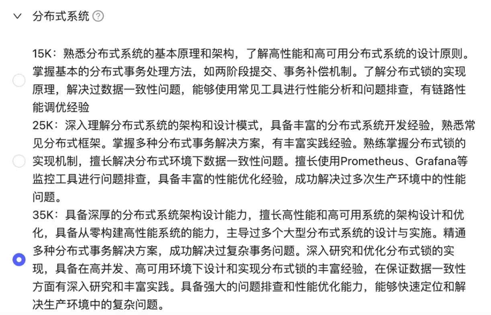

# 分布式篇

CAP理论

ShardingJDBC分库分表、RabbitMQ、RocketMQ、Kafka、Elasticsearch、Netty、

性能监控Prometheus + Grafana

## 分布式-运维监控

### Prometheus+Grafana

### 分布式日志存储框架

方案一：

业务服务 --> Prom tail --> Grafana loki <--Grafana

https://blog.csdn.net/weixin_49124386/article/details/134188206

方案二：

业务服务---> mq ---> 日志消息消费服务 ---> mongodb ---> web页面展示日志（需要自己实现）

日志数据量达、灵活数据格式、复杂的查询

方案三：

业务服务 ---> fileBeat ---> mq服务 ---> elasticsearch ---> kibana(展示日志)