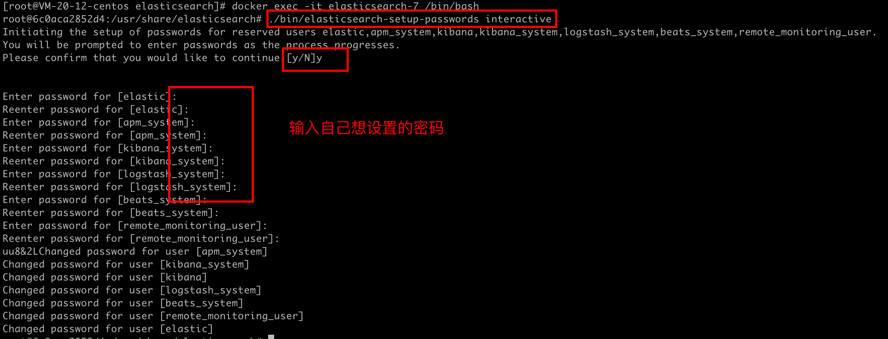
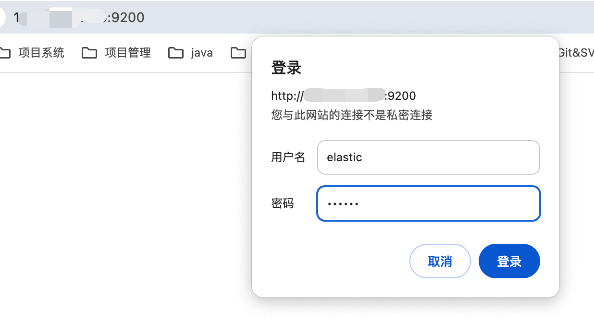
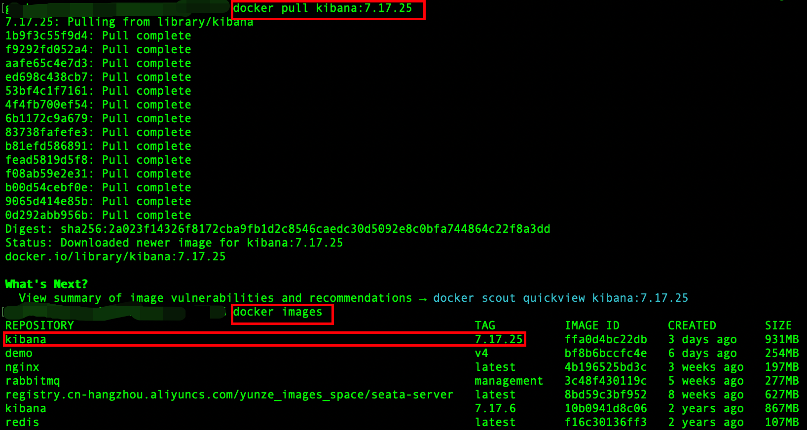
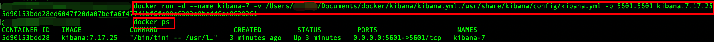
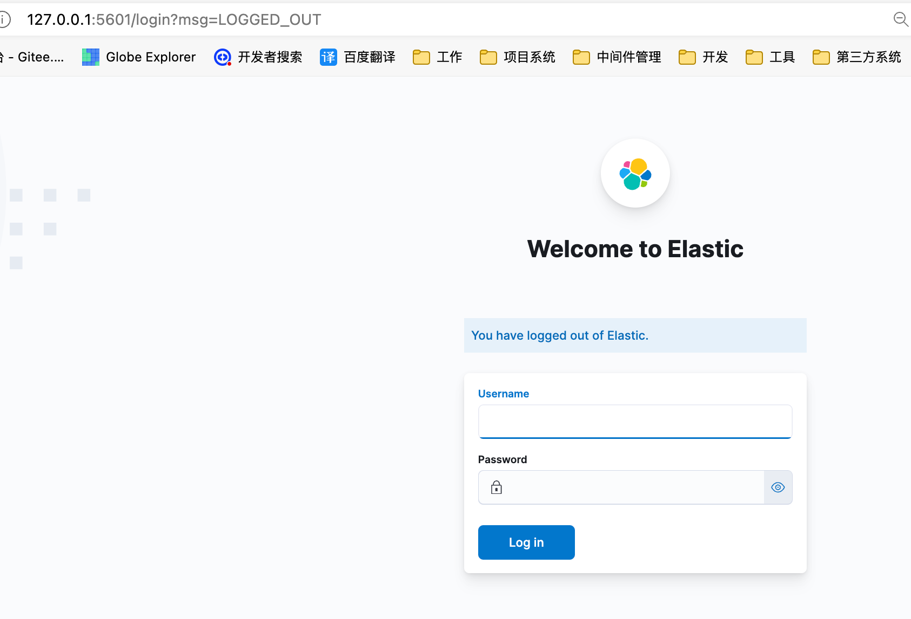

使用 Docker 简洁快速的去部署Kibana工具。

<!-- more -->

# 一、使用Docker部署Elasticsearch

## 拉取镜像

```shell
docker pull elasticsearch:7.17.25
```

准备容器里配置文件、数据文件、日志文件、插件目录挂载到宿主目录

```shell
mkdir /usr/local/tools/elasticsearch/data /usr/local/tools/elasticsearch/config /usr/local/tools/elasticsearch/plugins /usr/local/tools/elasticsearch/logs
```


## 运行容器

```shell
docker run -d --name elasticsearch-7 -e "discovery.type=single-node" -e "ES_JAVA_OPTS=-Xms1024m -Xmx1024m"  -v /usr/local/tools/elasticsearch/data:/usr/share/elasticsearch/data  -v /usr/local/tools/elasticsearch/plugins/:/usr/share/elasticsearch/plugins  -v /usr/local/tools/elasticsearch/logs/:/usr/share/elasticsearch/logs -v /usr/local/tools/elasticsearch/config/elasticsearch.yml:/usr/share/elasticsearch/config/elasticsearch.yml  -p 9200:9200  -p 9300:9300 elasticsearch:7.17.25
```

命令解析

```shell
docker run -d（后台运行） --name（容器命名） [容器名称] -e（设置配置） "discovery.type=single-node"（设置es为单机节点） -e "ES_JAVA_OPTS=-Xms1024m -Xmx1024m"（设置es的运行内存大小）  -v [宿主机的配置文件地址-数据文件]:[容器内配置文件地址-数据文件]  -v [宿主机的配置文件地址-插件地址]:[容器内配置文件地址-插件地址]  -v [宿主机的配置文件地址-日志文件]:[容器内配置文件地址-日志文件] -v [宿主机的配置文件地址-配置文件]:[容器内配置文件地址-配置文件]  -p [宿主机端口]:[容器内运行服务端口9200]  -p [宿主机端口]:[容器内运行服务端口9300] [要使用的镜像名]:[要使用的镜像版本号]
```

挂载的elasticsearch.yml配置信息如下

```yaml
cluster.name: docker-es-cluster
node.name: docker-es-node-153
network.host: 0.0.0.0
http.port: 9200

xpack.security.enabled: true
xpack.security.transport.ssl.enabled: true

http.cors.enabled: true
http.cors.allow-origin: "*"
```


## 设置密码

进入运行中的容器

```shell
docker exec -it elasticsearch-7 /bin/bash
```

设置密码

```shell
./bin/elasticsearch-setup-passwords interactive
```




## 访问验证

如果防火墙没有限制，就可以直接访问了，如果有限制，则需要先开放9200端口




# 二、使用Docker部署Kibana

## 拉取镜像

```shell
docker pull kibana:7.17.25
```



## 运行容器

```shell
docker run -d --name kibana-7 -v /Users/xxx/Documents/docker/kibana/kibana.yml:/usr/share/kibana/config/kibana.yml -p 5601:5601 kibana:7.17.25
```

命令解析

```shell
docker run -d（后台运行） --name（容器命名） [容器名称] -v（文件挂载） [宿主机的配置文件地址]:[容器内配置文件地址] -p（端口映射） [宿主机端口]:[容器内运行服务端口] [要使用的镜像名]:[要使用的镜像版本号]
```




挂载的kibana.yml配置信息如下

```yaml
# kibana访问端口
server.port: 5601
# 允许访问地址
server.host: "0.0.0.0"
# es地址
elasticsearch.hosts: ["http://127.0.0.1:9200"]
# 账号
elasticsearch.username: "elastic"
# 密码
elasticsearch.password: "12345678"
```


## 访问验证

kibana容器启动之后可访问

http://127.0.0.1:5601/

