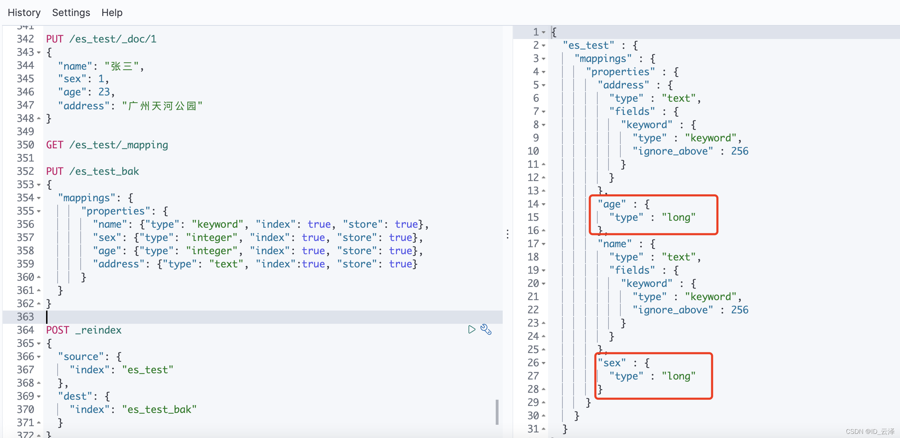
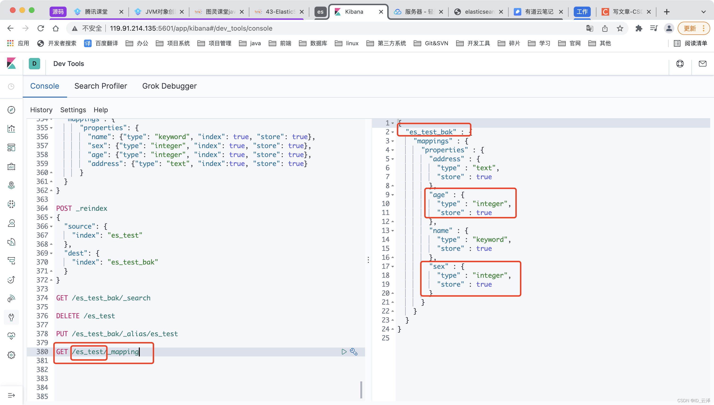

针对es上已经存在的索引，在某些情况下可能需要变更其字段属性的数据类型，但是es是没有办法像关系数据库一样直接使用一行alter命令解决的。

本文就针对这一需求，使用一种数据迁移的办法实现了索引的字段属性数据类型变更。

<!-- more -->

# 轻松搞定Elasticsearch的索引字段类型变更

现有这么一个索引es_test，需要要将age属性和sex的属性的数据类型从long改为integer

```
PUT /es_test/_doc/1
{
  "name": "张三",
  "sex": 1,
  "age": 23,
  "address": "广州天河公园"
}
```
原es_test的映射如下图右侧所示；


## 第一步，创建一个新的索引，定义好所需映射

```
PUT /es_test_bak
{
  "mappings": {
      "properties": {
        "name": {"type": "keyword", "index": true, "store": true},
        "sex": {"type": "integer", "index": true, "store": true},
        "age": {"type": "integer", "index": true, "store": true},
        "address": {"type": "text", "index":true, "store": true}
      }  
  }
}
```
## 第二步，将es_test索引的数据复制到es_test_bak索引里

```
POST _reindex
{
  "source": {
    "index": "es_test"
  },
  "dest": {
    "index": "es_test_bak"
  }
}
```


## 第三步，删除掉原es_test索引

```
DELETE /es_test
```

## 第四步，给es_test_bak索引设置一个es_test的别名

```
PUT /es_test_bak/_alias/es_test
```
## 第五步，确认验证

