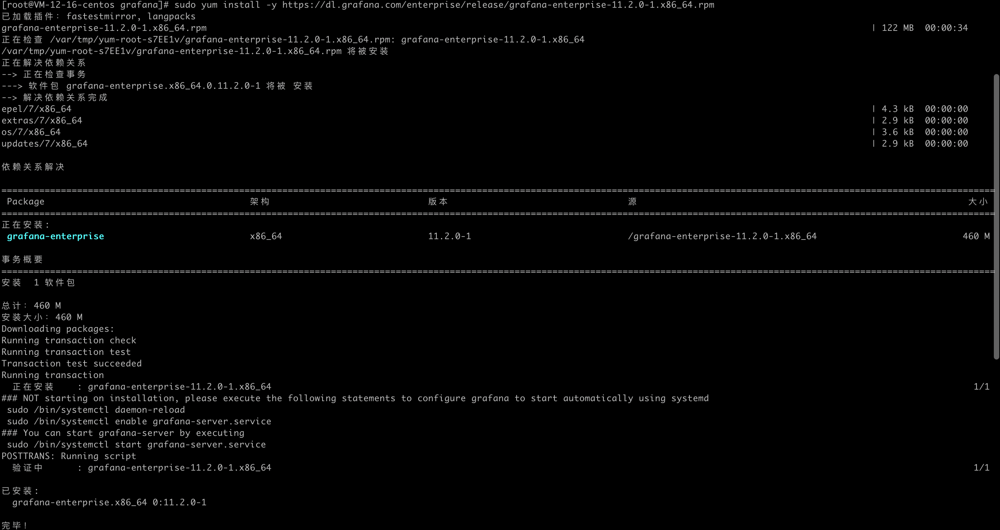
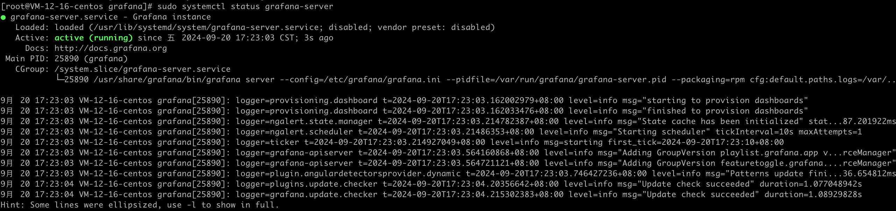
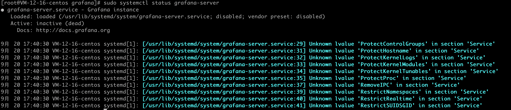

# Grafana安装部署

## Grafana服务的默认基础信息

访问地址：http://IP地址:3000

默认账号：admin

默认密码：admin


## CentOS系统部署

执行如下命令即可

```shell
sudo yum install -y https://dl.grafana.com/enterprise/release/grafana-enterprise-11.2.0-1.x86_64.rpm
```




## 其他系统

可以去看官方文档

https://grafana.com/grafana/download?pg=graf&platform=linux&plcmt=deploy-box-1


## 常用命令

### 启动服务

```shell
sudo systemctl start grafana-server
```

### 关停服务

```shell
sudo systemctl stop grafana-server
```

### 查看服务状态

```shell
sudo systemctl status grafana-server
```

运行状态



关停状态

