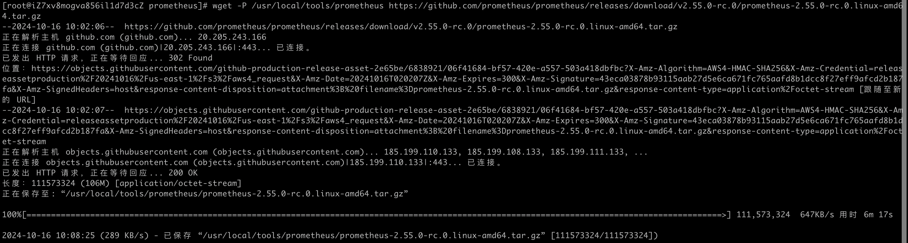
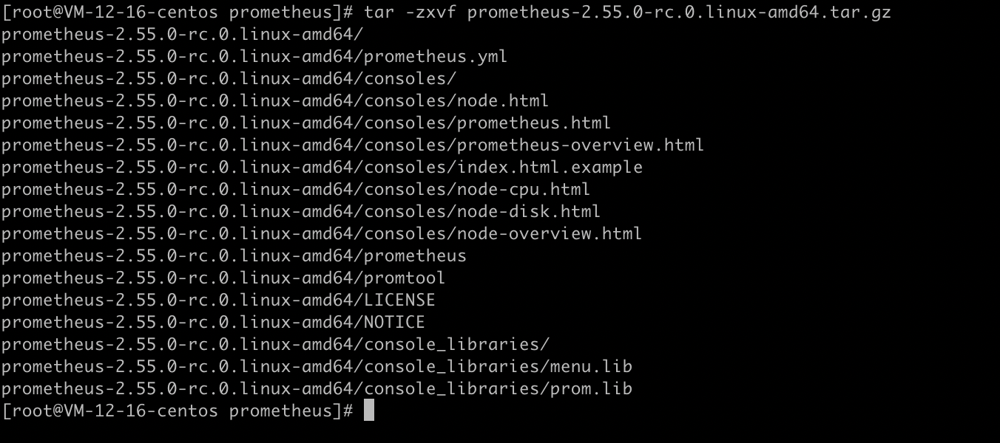

Grafana + Prometheus（普罗米修斯）实现系统的性能监控

<!-- more -->

# Grafana安装部署

## Grafana服务的默认基础信息

访问地址：http://IP地址:3000

默认账号：admin

默认密码：admin


## CentOS系统部署

执行如下命令即可

```shell
sudo yum install -y https://dl.grafana.com/enterprise/release/grafana-enterprise-11.2.0-1.x86_64.rpm
```


## 其他系统

可以去看官方文档

https://grafana.com/grafana/download?pg=graf&platform=linux&plcmt=deploy-box-1


## 常用命令

### 启动服务

```shell
sudo systemctl start grafana-server
```

### 关停服务

```shell
sudo systemctl stop grafana-server
```

### 查看服务状态

```shell
sudo systemctl status grafana-server
```

运行状态


关停状态


## prometheus安装

下载安装包

下载命令

```shell
wget -P /usr/local/tools/prometheus https://github.com/prometheus/prometheus/releases/download/v2.55.0-rc.0/prometheus-2.55.0-rc.0.linux-amd64.tar.gz
```

> 注意：需要检查下服务器的cpu型号是否是amd（x86）的，如果是arm的得换成arm包的下载地址。



解压安装包

/usr/local/prometheus

解压命令

```shell
tar -zxvf prometheus-2.55.0-rc.0.linux-amd64.tar.gz
```





