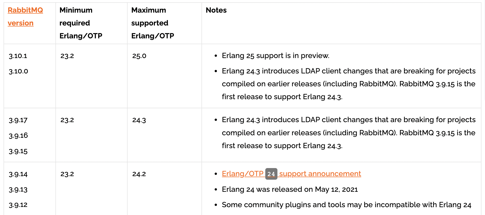
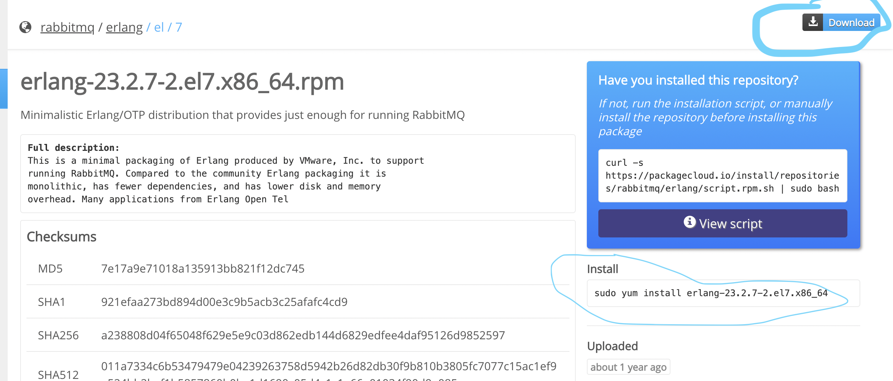
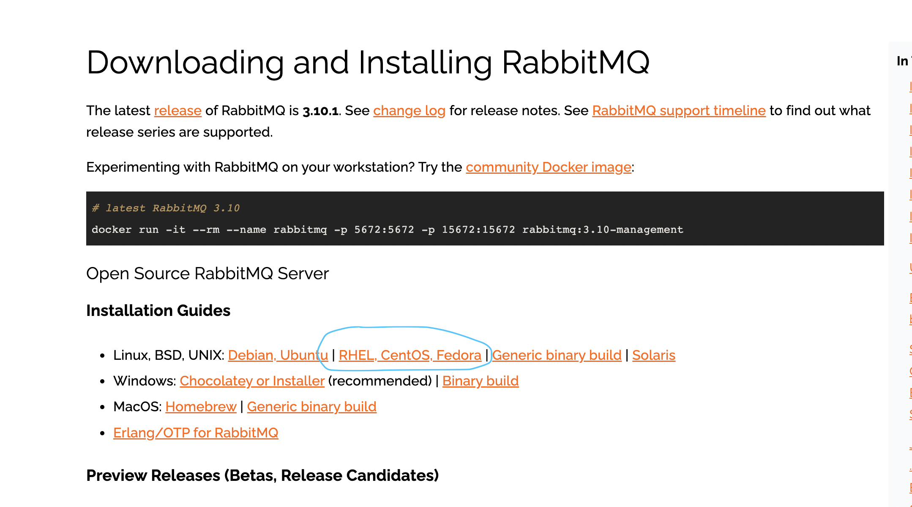
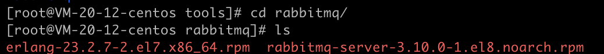
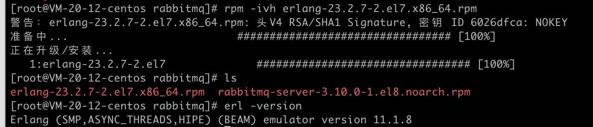
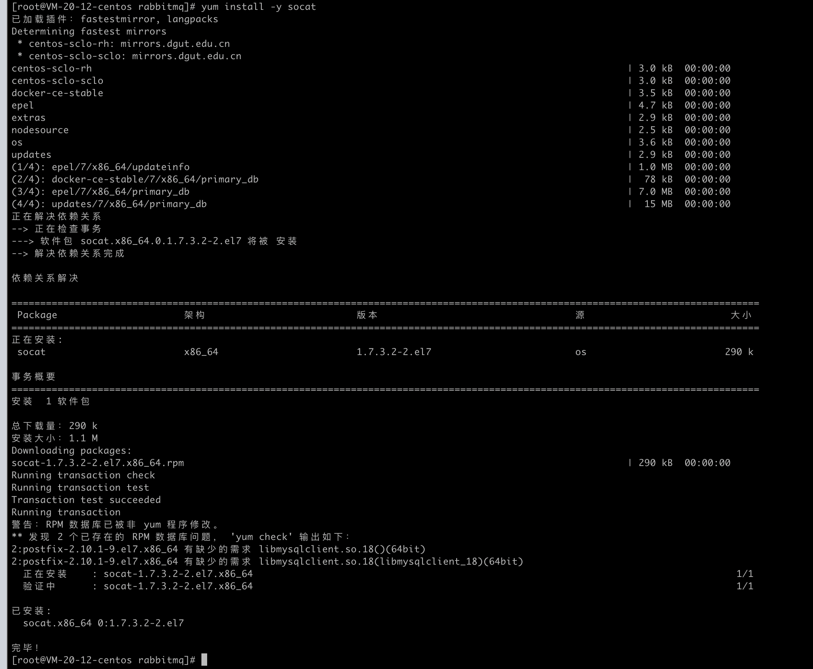
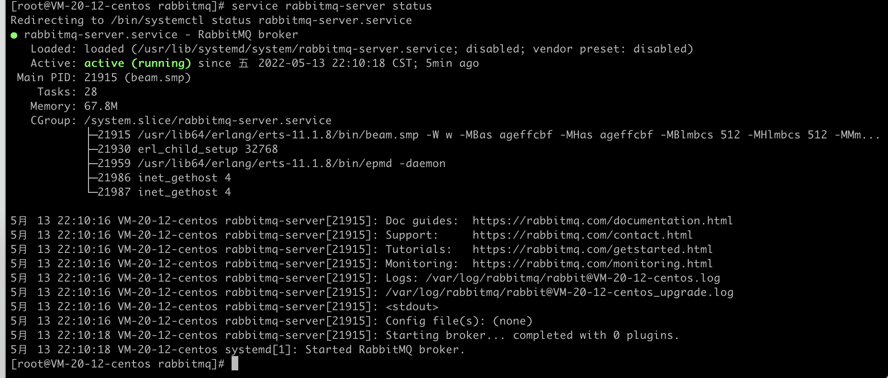
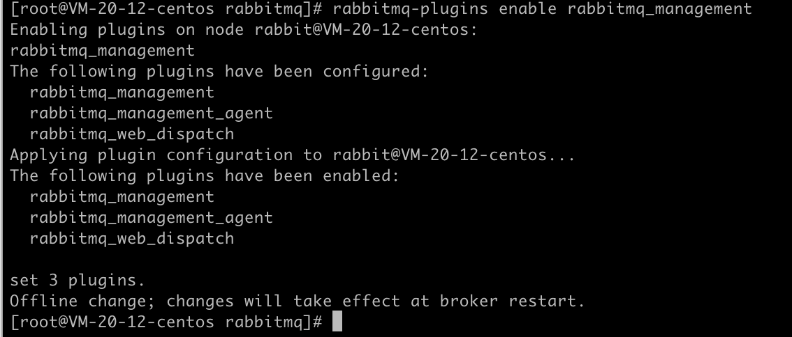
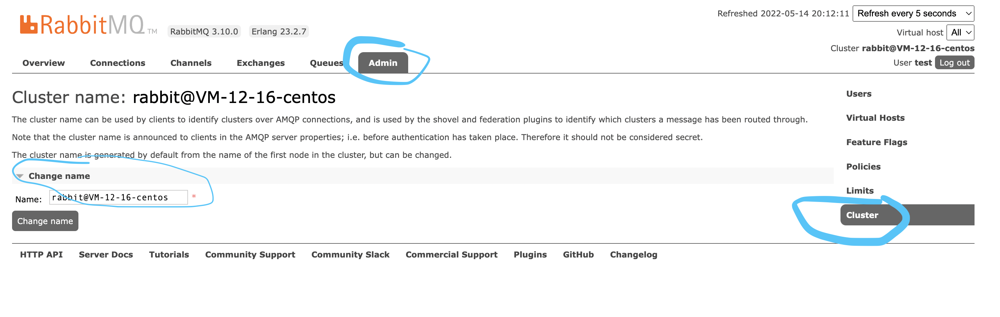
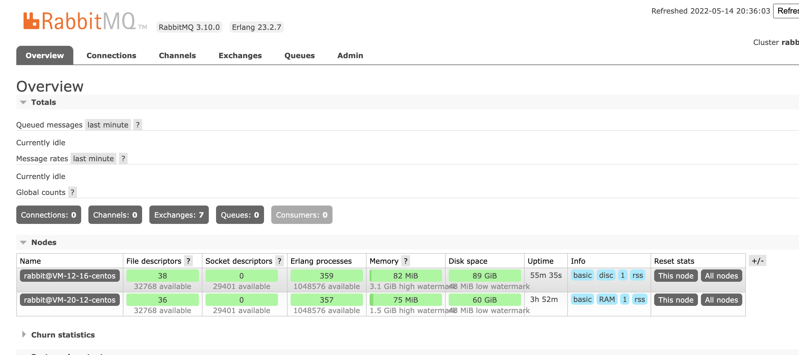

使用图文结合，详细讲述rabbitmq从下载到安装使用的每一个步骤。

<!-- more -->

# RabbitMQ安装

## 1. erlang和RabbitMQ的版本需求对照

对照地址：https://www.rabbitmq.com/which-erlang.html



## 2. 下载erlang和rabbitmq的安装包

erlang下载地址：https://packagecloud.io/rabbitmq/erlang/packages/el/7/erlang-23.2.7-2.el7.x86_64.rpm

rabbitmq下载地址：https://www.rabbitmq.com/download.html






## 3.上传到服务器



### 3.1 安装erlang

安装命令：

```java
rpm -ivh erlang-23.2.7-2.el7.x86_64.rpm
```

验证命令：

```java
erl -version
```



### 3.2 安装RabbitMQ

安装RabbitMQ需要提前安装一个socat。

socat安装命令：

```java
yum install -y socat
```



解压安装命令：

```java
rpm -Uvh rabbitmq-server-3.10.0-1.el8.noarch.rpm
```

### 3.3 启动RabbitMQ服务

服务启动命令：

```java
service rabbitmq-server start
```

查看RabbitMQ状态：

```
service rabbitmq-server status
```



### 3.4 RabbitMQ常用操作

重启服务：

```
service rabbitmq-server restart
```

停止服务：

```
service rabbitmq-server stop
```

启动服务：

```
service rabbitmq-server start
```

查看服务状态：

```
service rabbitmq-server status
```

### 3.5 安装并启动RabbitMQ的Web管理界面

安装启动命令：

```
rabbitmq-plugins enable rabbitmq_management
```



由最后提示可知，需要重启RabbitMQ服务；

可执行：

```
service rabbitmq-server restart
```

web页面地址：

```
服务器IP地址:15672/#/
```

默认账户密码均为：**guest**

该账户只能在RabbitMQ本机访问，所以需要添加一个原创登录的用户

添加用户：

```java
rabbitmqctl add_user 用户名 密码
```

设置角色权限：

```
rabbitmqctl set_user_tags 用户名 角色
```

设置资源权限：

```
  rabbitmqctl set_permissions -p / 用户名 ".*" ".*" ".*"
```

角色有如下四种：

- `administrator`：可以登录控制台、查看所有信息、并对rabbitmq进行管理
- `monToring`：监控者；登录控制台，查看所有信息
- `policymaker`：策略制定者；登录控制台指定策略
- `managment`：普通管理员；登录控制


如果访问不了页面，需要先关闭防火墙（如果是云服务器，需开放端口15672）


## 4. 集群部署

### 4.1 部署第二个RabbitMQ服务台服务器按照上述说明

在第二台服务器上安按照上述说明部署第二个RabbitMQ服务，使其能正常访问；

此时两台机信息如下：

| ip地址     | 机器名          | RabbitMQ节点名         |
| ---------- | --------------- | ---------------------- |
| 10.0.20.12 | VM-20-12-centos | rabbit@VM-20-12-centos |
| 10.0.12.16 | VM-12-16-centos | rabbit@VM-12-16-centos |

Rabbit节点名查看方式如下：



### 4.2 同步集群的cookie

保证两台机上 /var/lib/rabbitmq/目录下的.erlang.cookie文件里的字符串是一样的；

```
[root@VM-12-16-centos ~]# cd /var/lib/rabbitmq/
[root@VM-12-16-centos rabbitmq]# ls -a
.  ..  .erlang.cookie  mnesia
[root@VM-12-16-centos rabbitmq]# vim .erlang.cookie
```

修改好后重启rabbitmq；

### 4.3 保证各服务器之间可以相互访问

修改主机hosts配置，在最后加上各节点的机器名与ip的映射，这里在VM-12-16-centos服务器加上了VM-20-12-centos服务器的ip地址；

```java
[root@VM-12-16-centos rabbitmq]# vim /etc/hosts
```

```
127.0.0.1 VM-12-16-centos VM-12-16-centos
127.0.0.1 localhost.localdomain localhost
127.0.0.1 localhost4.localdomain4 localhost4

::1 VM-12-16-centos VM-12-16-centos
::1 localhost.localdomain localhost
::1 localhost6.localdomain6 localhost6

10.0.20.12 VM-20-12-centos
```

刷新DNS缓存

```
[root@VM-12-16-centos rabbitmq]# /etc/init.d/network restart
Restarting network (via systemctl):                        [  OK  ]
```

测试两台服务器能不能互相ping的通

```
ping VM-12-16-centos
ping VM-20-12-centos
```

### 4.4 加入集群

将VM-20-12-centos服务器的RabbitMQ加入到VM-12-16-centos服务器的集群；

先确保两台RabbitMQ都正常执行，然后执行如下命令：

```java
rabbitmqctl stop_app
rabbitmqctl join_cluster --ram rabbit@VM-12-16-centos
rabbitmqctl start_app
```

> --ram 表示以Ram节点加入集群。RabbitMQ的集群节点分为disk和ram。disk节点会将元数据保存到硬盘当中，而ram节点只是在内存中保存元数据（Exchanges和Quea）。
>
> 由于ram节点减少了很多与硬盘的交互，所以，ram节点的元数据使用性能会比较高。但是，同时，这也意味着元数据的安全性是不如disk节点的。在我们这个集群中，VM-20-12-centos以ram节点的身份加入到VM-12-16-centos集群里，因此，是存在单点故障的。如果VM-12-16-centos节点服务崩溃，那么元数据就有可能丢失。



### 4.5 查看集群状态

执行命令：

```java
rabbitmqctl cluster_status
```

### 4.6 搭建镜像集群

在普通集群的基础上继续搭建镜像集群；

```
rabbitmqctl add_vhost /mirror
rabbitmqctl set_policy ha-all --vhost "/mirror" "^" '{"ha-mode":"all"}'
```

