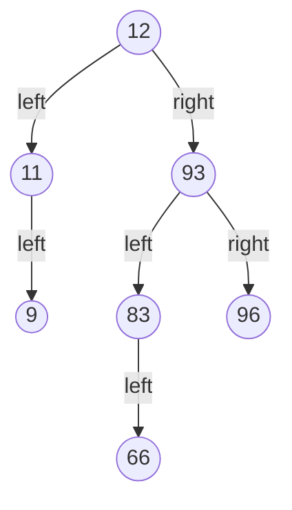

MySQL数据库在面试过程中，常常会被问到问题有索引结构、性能调优、分库分表、锁。

<!-- more -->

# MySQL常见的面试题

## MySQL的索引是什么？

索引是针对数据表里某个字段或某些字段，做好排序的数据结构。

## MySQL数据库innodb引擎的索引结构为什么用B+树？

索引的数据结构可以有如下几种：二叉树、红黑树、Hash表、B-Tree

案例数据：表a有如下两个字段，且两个字段数据如下

| 字段a | 12   | 93   | 11   | 83   | 66   | 96   | 9    |
| ----- | ---- | ---- | ---- | ---- | ---- | ---- | ---- |
| 字段b | 1    | 2    | 3    | 4    | 5    | 6    | 7    |

### 二叉树（二叉查找树）

如果索引数据结构是二叉树（二叉查找树）（有序的）：

则字段a的索引结构为

此时如果要查询数据 `83` ,则查询路径为12--93--83，查询的很快，看起来很适合做索引的数据结构。

但是如果给字段b按照二叉树（二叉查找树）结构排好序，则为

此时如果要查询数据 `7` ，则查询路径为1--2--3--4--5--6--7，将所有数据都遍历了一遍，相当于是一个链表了，查询效率就很低。

所以二叉树（二叉查找树）不适合查询有序数据，所以没有被应用于mysql的索引结构。

### 红黑树

红黑树是平衡二叉查找树。在二叉查找树的基础上增加了平衡属性，什么是平衡属性呢？就是在整个红黑树上的任意一个节点，它的左右子树高度相差不会大于1。

