本文详细介绍了Java中 `HashMap` 的数据结构及其工作原理，并深入探讨了它的扩容机制。首先，文章解释了 `HashMap` 内部是如何通过哈希算法来存储和检索数据的，包括链表和红黑树这两种解决哈希冲突的方法。

<!-- more -->

# Java基础面试必知：HashMap的数据结构与扩容机制

在Java开发中， HashMap是使用最为广泛的数据结构之一，它提供了基于键值对的快速存取功能。然而，在面试中，经常会涉及到HashMap的底层实现原理，特别是其数据结构和扩容机制。

## HashMap的数据结构

HashMap本质上是一个数组（初始数组长度默认为16），但它并不是一个简单的数组，而是由一系列桶（bucket）组成的数组。每个桶都可以存储一个键值对，也可以存储一个链表或红黑树来处理哈希冲突。

### **1. 哈希算法：**

当一个键值对被加入到HashMap中时，首先会对键进行哈希计算，得到一个哈希码。这个哈希码会被进一步转换成数组索引，以确定键值对应该存储的位置。

### **2. 解决哈希冲突：**

由于哈希函数可能会导致不同的键产生相同的哈希码，因此需要一种方法来处理这种情况。

在Java 8之前， HashMap使用链表来解决哈希冲突；

而在Java 8中，当链表的长度等于8时，链表就会被转换成红黑树，以提高查找效率。当数据结构为红黑树之后，又去操作删除节点，使节点数等于6时，就会再转为链表。

## HashMap的扩容机制

当 HashMap中的元素数量达到其容量与负载因子（load factor）的乘积时，就会触发扩容操作。默认情况下， HashMap的初始容量为16，负载因子为0.75，这就意味着当HashMap的容量使用率达到75%时，就认为是时候进行扩容了。

### **1. 扩容时机：**

当 HashMap 的大小超过了容量与负载因子的乘积（当前HashMap的大小 > 当前容量 × 负载因子）时，就会触发扩容。

扩容会创建一个新的更大容量的数组（**新数组是旧数组的两倍**），并将原有数组中的所有键值对重新计算哈希码，分配到新的数组中。

### **2. 扩容过程：**

扩容过程中，HashMap会创建一个新的数组，通常是当前容量的两倍。然后，原数组中的所有元素都会被重新哈希，并放置到新的数组中相应的位置。这个过程可能会改变元素在数组中的分布情况，因为哈希码计算的结果可能会有所不同。

## 总结

我们了解到 HashMap 的数据结构是由数组、链表和红黑树组成的，它通过哈希算法来确定键值对的存储位置，并通过扩容机制来应对数据量的增长。
