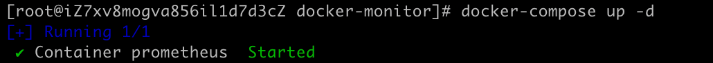

Docker常用操作和常用中间件的部署。

<!-- more -->

# Docker运维操作


## 一、CentOS系统安装Docker

### 1.准备docker所需环境

##### 执行命令清理相关环境，防止出现冲突

```shell
sudo yum remove docker     docker-client     docker-client-latest     docker-common     docker-latest     docker-latest-logrotate     docker-logrotate     docker-engine
```


##### 安装yum-utils工具包

```shell
sudo yum install -y yum-utils
```


##### 设置阿里的镜像

```shell
sudo yum-config-manager --add-repo http://mirrors.aliyun.com/docker-ce/linux/centos/docker-ce.repo
```


### 3.安装docker

```shell
sudo yum install docker-ce docker-ce-cli containerd.io
```


启动docker

```shell
sudo systemctl start docker
```


### 2.验证docker

查看docker版本

```shell
docker -v
```


设置镜像源，推荐使用阿里的

```shell
sudo tee /etc/docker/daemon.json <<EFO
{
	"registry-mirrors": [
		"https://xxxxxxx.mirror.aliyuncs.com"
	]
}
EFO
```


```shell
# 加载新配置信息
sudo systemctl daemon-reload
# 重启docker
sudo systemctl restart docker
```


docker 切换镜像

[可用] https://www.cnblogs.com/xietingfeng321/p/18451170

## 二、Docker常用操作

docker 安装redis

1. 拉取redis镜像
   ```shell
    docker pull redis:latest
   ```

2. 查看本地镜像
   ```shell
    docker images
   ```

3. 运行容器
    ```shell
    docker run -itd --name redis-dev -p 6379:6379 redis --requirepass "foobared"
    ```

4. 查看运行中的容器
    ```shell
    docker ps
    ```

5. 进入容器空间操作
    ```shell
    docker exec -it redis-dev /bin/bash
    ```

6. 关闭运行中的容器

   先使用命令 `docker ps` 查看处于运行中的容器

   ```shell
   yunze@yunzedeMacBook-Pro ~ % docker ps
   CONTAINER ID   IMAGE     COMMAND                   CREATED        STATUS        PORTS                    NAMES
   039e8dbc0fed   redis     "docker-entrypoint.s…"   40 hours ago   Up 40 hours   0.0.0.0:6379->6379/tcp   redis-dev
   ```

   然后根据运行中容器的 `CONTAINER ID` 去关闭容器

   ```shell
   yunze@yunzedeMacBook-Pro ~ % docker stop 039e8dbc0fed
   039e8dbc0fed
   ```
   
7. 删除容器

   ```shell
   docker rm 039e8dbc0fed # (容器ID，CONTAINER ID)
   ```
   
8. 删除镜像

   ```shell
   docker rmi [IMAGE ID]
   ```
9. 运行rabbitmq镜像

   ```shell
   docker run -d --name=rabbitmq -v /usr/local/docker/rabbitmq:/var/lib/rabbitmq -p 15672:15672 -p 5672:5672 -e RABBITMQ_DEFAULT_USER=admin -e RABBITMQ_DEFAULT_PASS=admin rabbitmq:management
   ```


10. 查询中间件镜像的具体版本

    ```shell
    docker image inspect redis:latest | grep -i version
    ```

    

## 三、镜像导入导出

### 将镜像保存为tar文件

```shell
docker save [IMAGE ID] > nacos-2.3.2.tar
```


### 将tar文件载入docker

```shell
docker load < nacos-2.3.2.tar
```


### 修改镜像的名称和TAG版本

构建一个镜像之后，发现镜像的名称和TAG为none


修改方式

```shell
# docker tag [IMAGE ID] [新的REPOSITORY]:[新的TAG]
docker tag d3063c1db2bb nacos/nacos-server:v2.3.2
```


## 四、同一镜像多个系统架构版本解决方案
```shell
docker manifest create registry.cn-hangzhou.aliyuncs.com/yunze_images_space/seata-server:latest registry.cn-hangzhou.aliyuncs.com/yunze_images_space/seata-server:arm64 registry.cn-hangzhou.aliyuncs.com/yunze_images_space/seata-server:x64
```


```shell
docker manifest push registry.cn-hangzhou.aliyuncs.com/yunze_images_space/seata-server:latest && docker manifest rm registry.cn-hangzhou.aliyuncs.com/yunze_images_space/seata-server:latest
```


```shell
docker pull --platform=linux/amd64 registry.cn-hangzhou.aliyuncs.com/yunze_images_space/seata-server:latest
```


## 五、安装docker-compose

下载docker-compose的安装包

（可以去挑选合适自己的版本 https://github.com/docker/compose/releases）

```shell
wget https://github.com/docker/compose/releases/download/v2.29.7/docker-compose-linux-x86_64
```

将安装包重命名为 **docker-compose** ，并将其移动到 **/usr/local/bin/** 目录下

```shell
mv docker-compose-linux-x86_64 /usr/local/bin/docker-compose
```

授予其可执行权限

```shell
chmod +x /usr/local/bin/docker-compose
```

验证 **docker-compose**

```shell
docker-compose -version
```


## 六、使用docker-compose安装prometheus

先拉取prometheus的镜像

```shell	
# 也可以使用docker pull prom/prometheus:v2.54.1（使用后下文配置信息里的镜像名也要跟着调整）
docker pull registry.cn-guangzhou.aliyuncs.com/devyunze/prometheus:v2.54.1
```


在指定的目录下创建docker-compose.yml配置文件和prometheus目录


docker-compose.yml配置信息如下

```yaml
services:
  prometheus:
    image: registry.cn-guangzhou.aliyuncs.com/devyunze/prometheus:v2.54.1 # 指定镜像文件
    container_name: 'prometheus'	# 给容器命名
    volumes:
      - ./prometheus/:/etc/prometheus/		# 映射prometheus的配置文件
      - /etc/localtime:/etc/localtime:ro	# 让容器去使用宿主机的时间，保持和宿主机的时间一致
    ports:
      - '9090:9090'	# 映射端口
```


然后在prometheus目录下创建prometheus.yml配置文件


prometheus.yml配置文件为

```ya
global:
  scrape_interval: 15s  # 数据抓取间隔

scrape_configs:
  - job_name: 'prometheus'
    static_configs:
      - targets: ['localhost:9090']
```


启动

先回到docker-compose.ym配置文件所在的目录下


执行命令

```shell
docker-compose up -d
```



启动成功


防火墙开放端口限制之后就可以访问了

访问地址：http://127.0.0.1:9090


​	

## 七、使用docker-compose安装grafana

拉取grafana镜像

```shell
# 也可以使用docker pull grafana/grafana:11.2.3（使用后下文配置信息里的镜像名也要跟着调整）
docker pull registry.cn-guangzhou.aliyuncs.com/devyunze/grafana:11.2.3
```


在指定的目录下配置docker-compose.yml配置文件和grafana目录


docker-compose.yml配置信息如下（在部署了prometheus的基础上调整）

```yaml
services:
  prometheus:
    image: registry.cn-guangzhou.aliyuncs.com/devyunze/prometheus:v2.54.1
    container_name: 'prometheus'
    volumes:
      - ./prometheus/:/etc/prometheus/
      - /etc/localtime:/etc/localtime:ro
    ports:
      - '9090:9090'
  grafana:
    image: registry.cn-guangzhou.aliyuncs.com/devyunze/grafana:11.2.3
    container_name: 'grafana'
    volumes:
      - ./grafana/config/grafana.ini:/etc/grafana/grafana.ini	# 配置grafana的报警邮件发送服务
      - ./grafana/provisioning/:/etc/grafana/provisioning/	# 映射grafana的配置文件
      - /etc/localtime:/etc/localtime:ro	# 让容器去使用宿主机的时间，保持和宿主机的时间一致
    ports:
      - '3000:3000'	# 端口映射
    env_file:
      - ./grafana/config.monitoring	# 设置grafana的登录配置信息
    depends_on:
      - prometheus	# 设置grafana依赖于prometheus，需要在prometheus之后去启动
```


配置config.monitoring（grafana的认证配置）

```properties
# 设置grafana管理界面admin用户的登录密码
GF_SECURITY_ADMIN_PASSWORD=uYt7!rFF
# 控制grafana的管理界面不允许注册
GF_USERS_ALLOW_SIGN_UP=false
```


配置grafana的配置文件datasource.yml，用于设定其展示数据的数据来源


配置信息如下

```yaml
apiVersion: 1

deleDatasources:
  - name: Prometheus
    orgId: 1

datasources:
  - name: Prometheus
    type: prometheus
    access: proxy
    orgId: 1
    url: http://127.0.0.1:9090
    basicAuth: false
    isDefault: true
    version: 1
    editable: true
```


设置预警通知邮件配置文件grafana.ini


配置信息如下

```ini
[smtp]
# 是否开启邮件发送
enabled = true
# 发送服务器（固定的）
host = smtp.qq.com:465
# 发送者的邮箱账号（smtp账号）
user = 834363368@qq.com
# 授权码（smtp账号的授权码）
password = 66666666666
# 接收预警邮件的邮箱
from_address = 456789@qq.com
# 接收预警邮件的用户名称
from_name = 云泽
```

