Jenkins 是一个开源的持续集成（Continuous Integration, CI）和持续交付（Continuous Delivery, CD）工具，广泛应用于软件开发过程中。它可以帮助团队自动化构建、测试和部署应用程序，从而提高开发效率和质量。

<!-- more -->

# Jenkins自动化部署

> 提示：本教程基于CentOS Linux 7系统下进行

## Jenkins的安装

### 1. 下载安装jdk11

   官网下载地址：https://www.oracle.com/cn/java/technologies/javase/jdk11-archive-downloads.html

   本文档教程选择的是jdk-11.0.20_linux-x64_bin.tar.gz

   解压jdk-11.0.20_linux-x64_bin.tar.gz命令为：

   ```shell
   tar -zxvf jdk-11.0.20_linux-x64_bin.tar.gz
   ```

   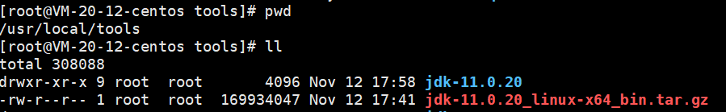

### 2. 下载Jenkins的war包

   官网下载地址：https://mirrors.tuna.tsinghua.edu.cn/jenkins/war-stable/2.414.3/jenkins.war

   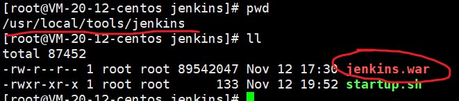

### 3. 准备Jenkins启动脚本

   编写一个Jenkins的启动脚本，简化之后每次启动都要敲命令；

   将Jenkins的访问端口设置为3001；（可以根据自己需求设置端口）

   创建startup.sh脚本

   ```shell
   vim /usr/local/tools/jenkins/startup.sh
   ```

   startup.sh脚本

   ```shell
   #!/bin/bash
   
   nohup /usr/local/tools/jdk-11.0.20/bin/java -jar /usr/local/tools/jenkins/jenkins.war --httpPort=3001 >/dev/null 2>&1 &
   ```

   使脚本具有执行权限

   ```shell
   chmod +x /usr/local/tools/jenkins/startup.sh
   ```

   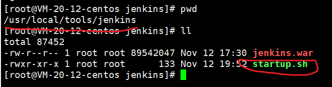

### 4. 启动Jenkins

   执行如下命令即可

   ```shell
   ./startup.sh
   ```

   初次启动Jenkins，系统会要求使用其自动生成的密码进行解锁，初始密码在 **/root/.jenkins/secrets/initialAdminPassword** 文件中，启动时的日志里也有打印出来；

### 5. 访问并解锁Jenkins

   访问http://IP:3001，等待解锁Jenkins页面出现，就是Unlock Jenkins页面，在Administrator password下的输入框输入你的启动Jenkins时获取的临时密码即可

## Jenkins的基础配置与插件安装

### 1. 基础插件安装

>    Dashboard-->系统管理(Manage Jenkins)-->插件管理(Plugins)-->Avaliable Plugins
>

   安装基础插件SSH server、Publish Over SSH、NodeJS Plugin、Maven Integration plugin、Git plugin、Git client plugin；

   下载插件后会提示要重启，自动重启后就会生效

   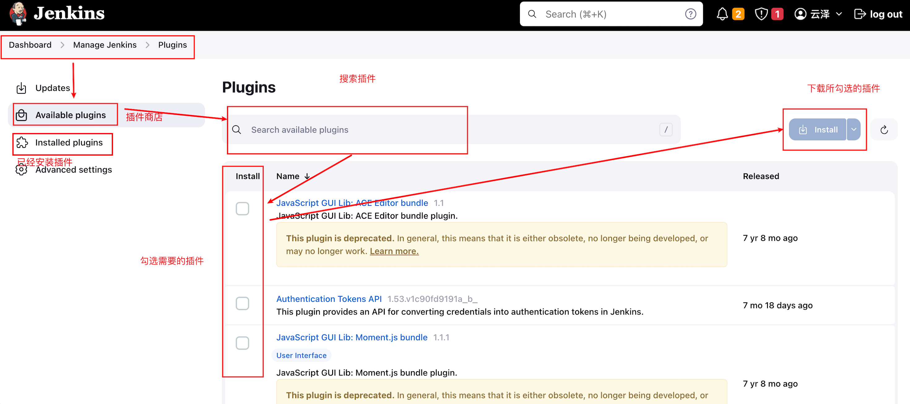

### 2. 配置项目运行所需的Jdk8环境

   - 官网下载地址：https://www.oracle.com/java/technologies/javase/javase8-archive-downloads.html

     本项目运行选择的是jdk-8u301-linux-x64.tar.gz

     可与之前Jenkins运行所需的jdk11放一起

     解压命令为

     ```shell
     tar -zxvf jdk-8u301-linux-x64.tar.gz
     ```

     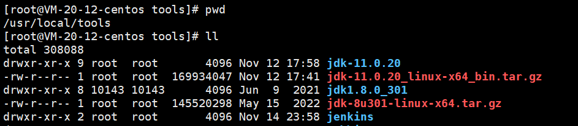

   - Jenkins配置JDK

     Dashboard-->系统管理(Manage Jenkins)-->全局工具配置(Tools)-->JDK安装

     新增JDK，JAVA_HOME配置jdk8的路径

     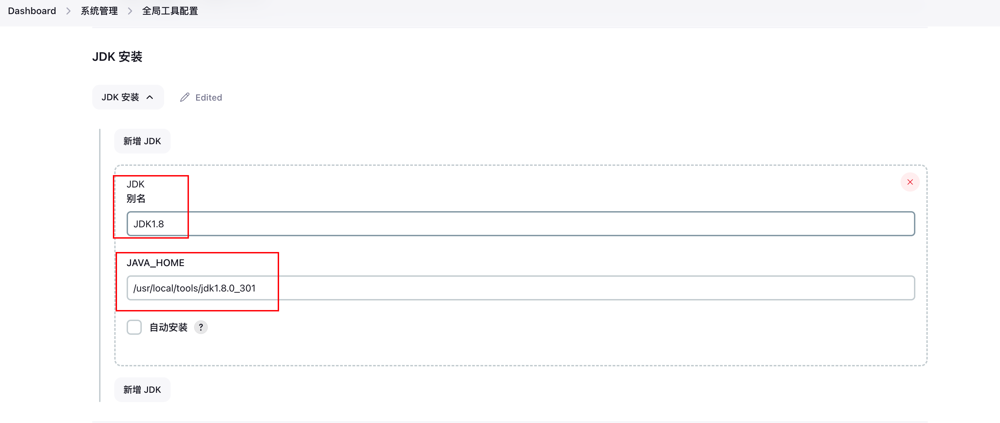

### 3. 配置Jenkins自动拉取代码所需的Git工具

   - Jenkins所在服务器上安装Git

     安装命令`sudo yum install -y git`

     查看git版本命令` git --version`

     安装git的可执行文件默认路径为`/usr/bin/git`

     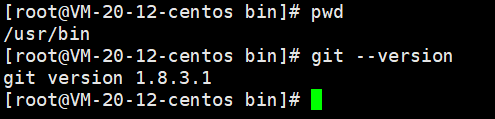

   - Jenkins上配置Git

     > Dashboard-->系统管理(Manage Jenkins)-->全局工具配置(Tools)-->Git installations
     >
     
     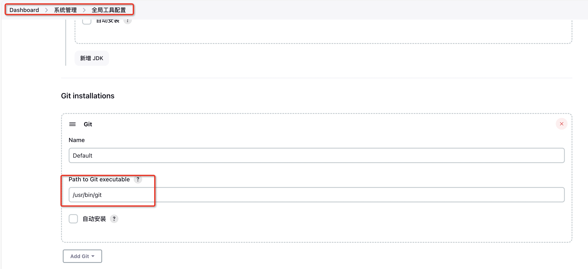

### 4. Maven安装

   > Dashboard-->系统管理(Manage Jenkins)-->全局工具配置(Tools)-->Git installations

   选择自己需要的maven版本即可，勾选自动安装

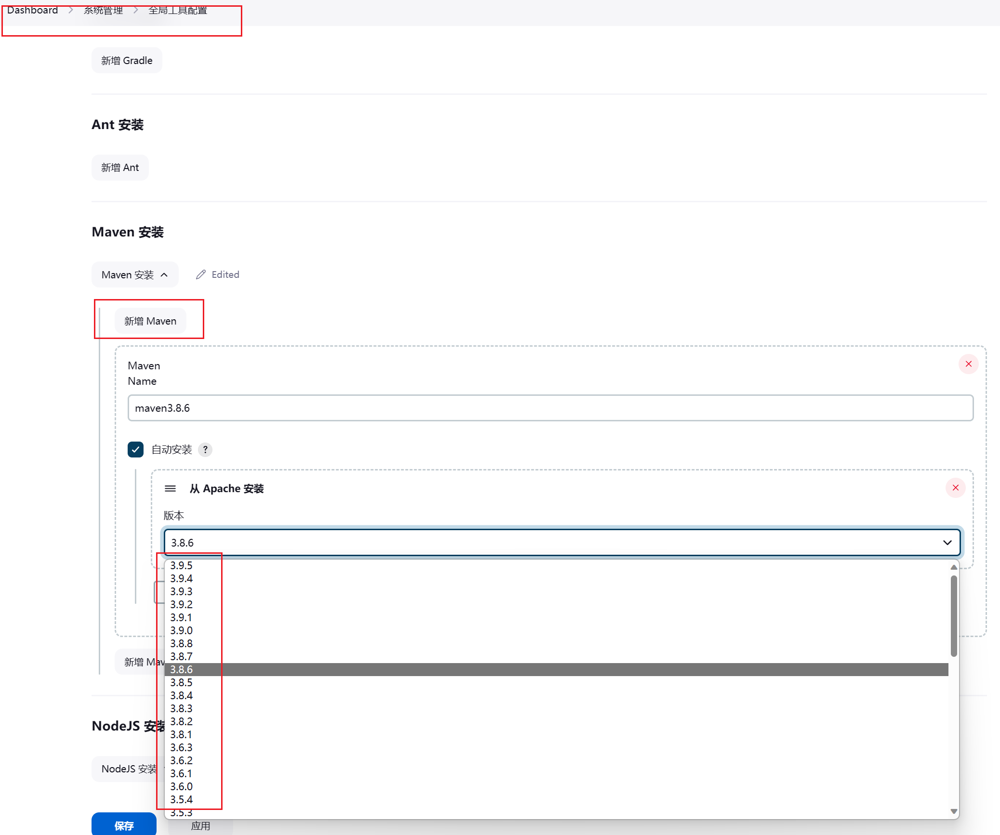

### 5. 配置Publish over SSH

   - 生成SSH密钥

     先**在Jenkins所在的服务器上生成ssh密钥**，注意是Jenkins所在的服务器，命令如下：

     ```shell
     ssh-keygen -t rsa -P ''
     ```

     然后一路回车键，接受默认文件位置和文件名，为了方便也不使用密码短语

     ```shell
     # 整个交互过程
     [root@VM-20-12-centos tools]# ssh-keygen -t rsa -P ''
     Generating public/private rsa key pair.
     Enter file in which to save the key (/root/.ssh/id_rsa): 
     Created directory '/root/.ssh'.
     Enter passphrase (empty for no passphrase): 
     Enter same passphrase again: 
     Your identification has been saved in /root/.ssh/id_rsa.
     Your public key has been saved in /root/.ssh/id_rsa.pub.
     The key fingerprint is:
     SHA256:RpNQDtJe92E5qovCrKhoO4CiN4Jn0Y3LT6SPbTKFg4E
     The key's randomart image is:
     +---[RSA 4096]----+
     |    ..o..    .   |
     |     ..+... =    |
     | .   . .=. + o   |
     |E .   .. .. .    |
     |.  + +. S.       |
     |+ o =oo..        |
     |=  =.+.. .       |
     |=+= O=o .        |
     |**+o.*+          |
     +----[SHA256]-----+
     [root@VM-20-12-centos tools]# 
     ```

     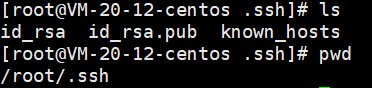

   - 上传公钥

     将生成的SSH密钥对里的公钥文件上传到jar包服务所需要运行的服务器，后面需要Jenkins自动将编译好的jar包上传到这台服务器上。

     ```shell
     cd ~
     ls .ssh/
     ssh-copy-id -i .ssh/id_rsa.pub 服务器IP地址
     ```

     整个命令的作用是将本地计算机的公钥文件复制到远程主机上的`authorized_keys`文件中，从而实现无密码登录；

   - 验证是否可以无密码登录远程

     ```shell
     ssh root@服务器IP地址
     ```

   - 在Jenkins上配置Publish over SSH

     > Dashboard-->系统管理(Manage Jenkins)-->系统配置（System）-->Publish over SSH

     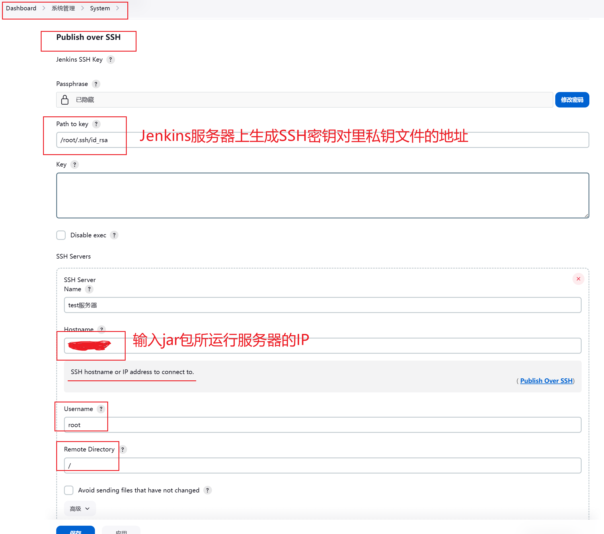

  环境准备完毕！

## 自动部署Maven项目

### 1. 创建一个Maven任务

   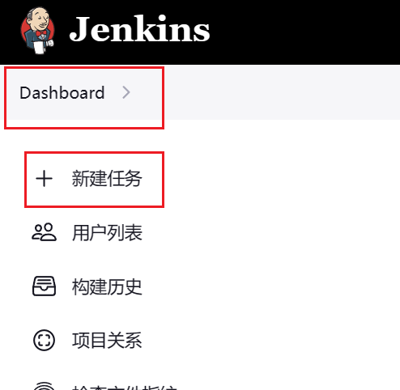

   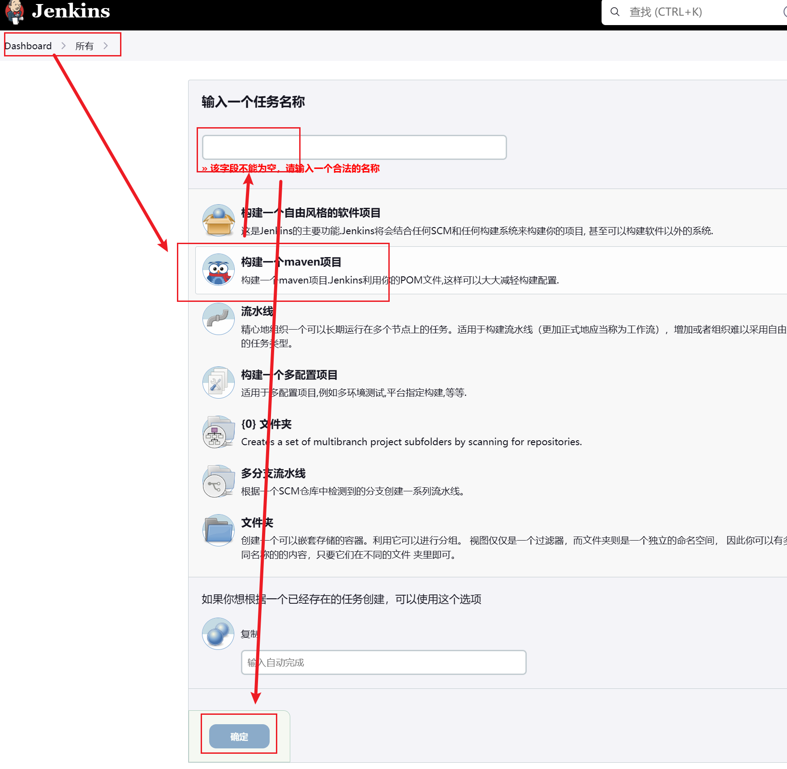

### 2. 配置General

   丢弃旧的构建核心意思就是将旧的jar包扔掉，如果有打算回滚服务到很多个版本之前，这里的“保持构建的最大个数”就得设置大一点。一般也就保留3~5个。

   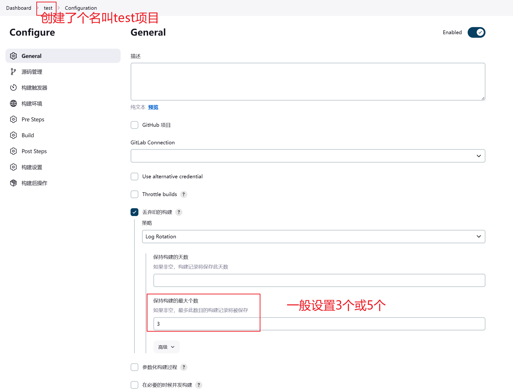

### 3. 源码管理配置

   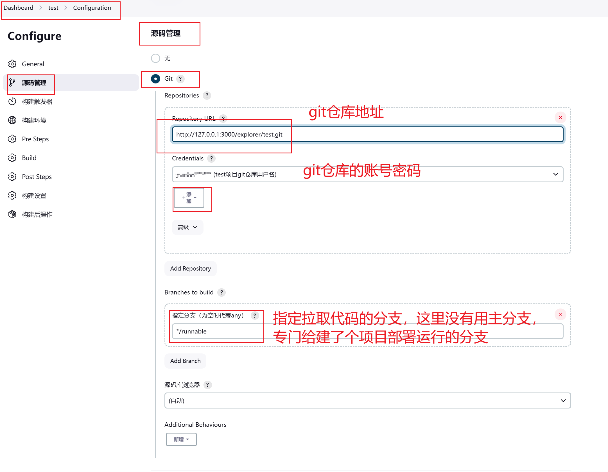

   添加git访问凭据，例：

   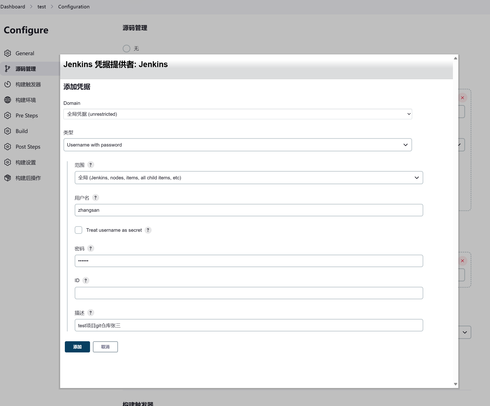

### 4. 构建触发器配置

   构建触发器：就是什么时候触发自动部署这个操作；

   一般只用定时构建和轮询PCM；

   定时构建：根据设置的日程表（类似于Cron），去定时自动拉取代码、编译打包、上传服务器、运行；

   轮询PCM：如果git仓库代码有变动，就自动拉取代码、编译打包、上传服务器、运行；

   因为是测试，所以此处用的是默认配置；

   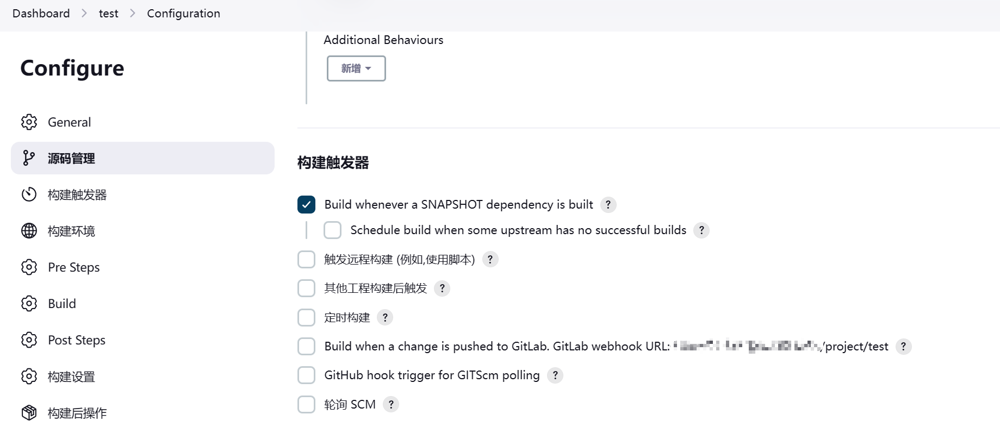

### 5. 构建环境配置

   选择我们在之前在`Dashboard-->系统管理(Manage Jenkins)-->全局工具配置(Tools)-->JDK安装`里配置JDK8即可；

   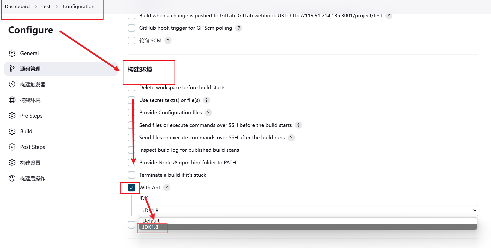

### 6. 编译打包配置

   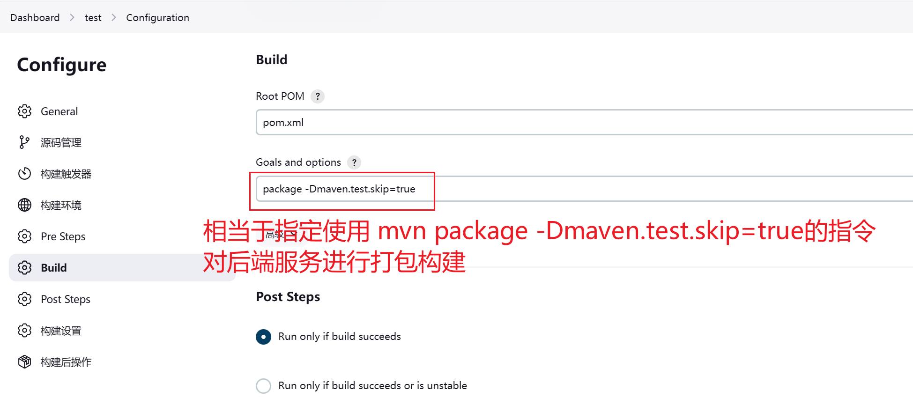

### 7. 服务上传运行配置

   jar包运行脚本

   ```shell
   source /etc/profile 
   cd /data/mall/test
   ps -ef|grep test-0.0.1-SNAPSHOT.jar|grep -v grep|awk '{print $2}'|xargs kill -s 9   
   BUILD_ID=dontKillMe 
   nohup java -jar test-0.0.1-SNAPSHOT.jar > nohup.out 2>&1 &
   ```

   

   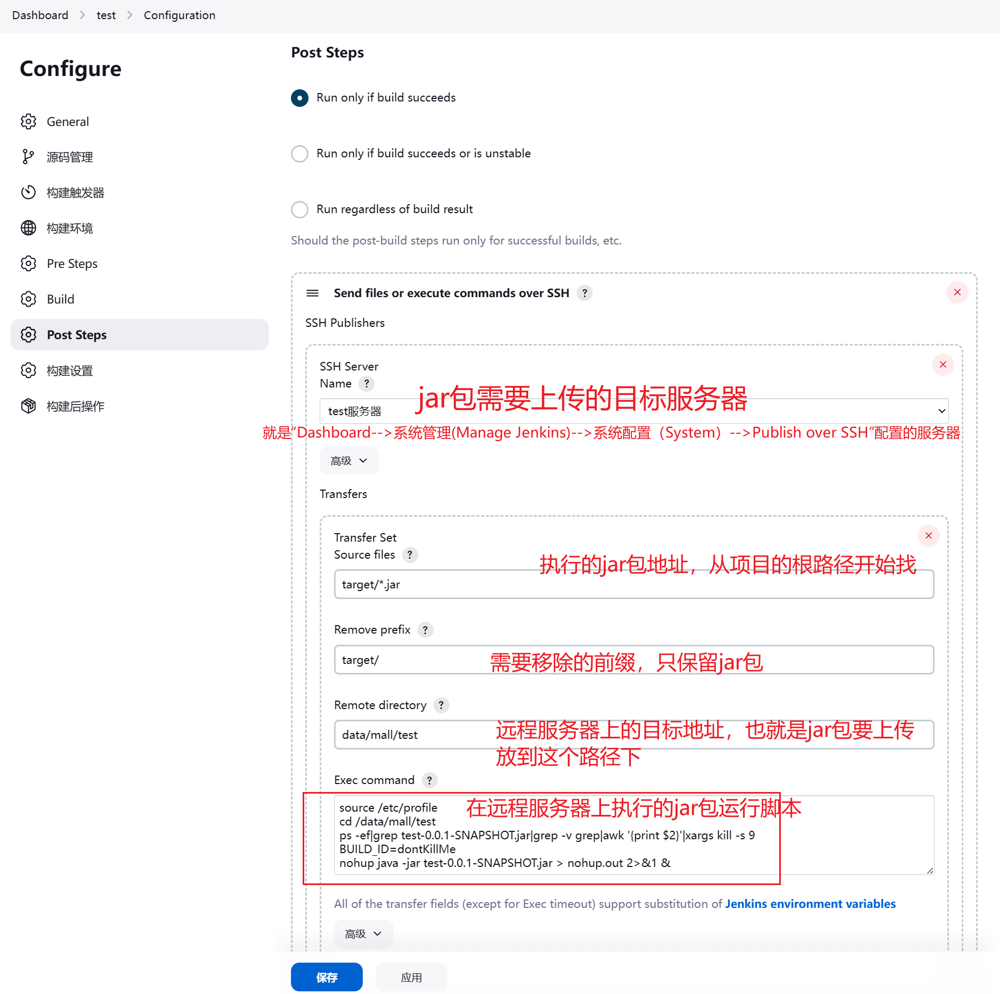

   test项目的目录结构

   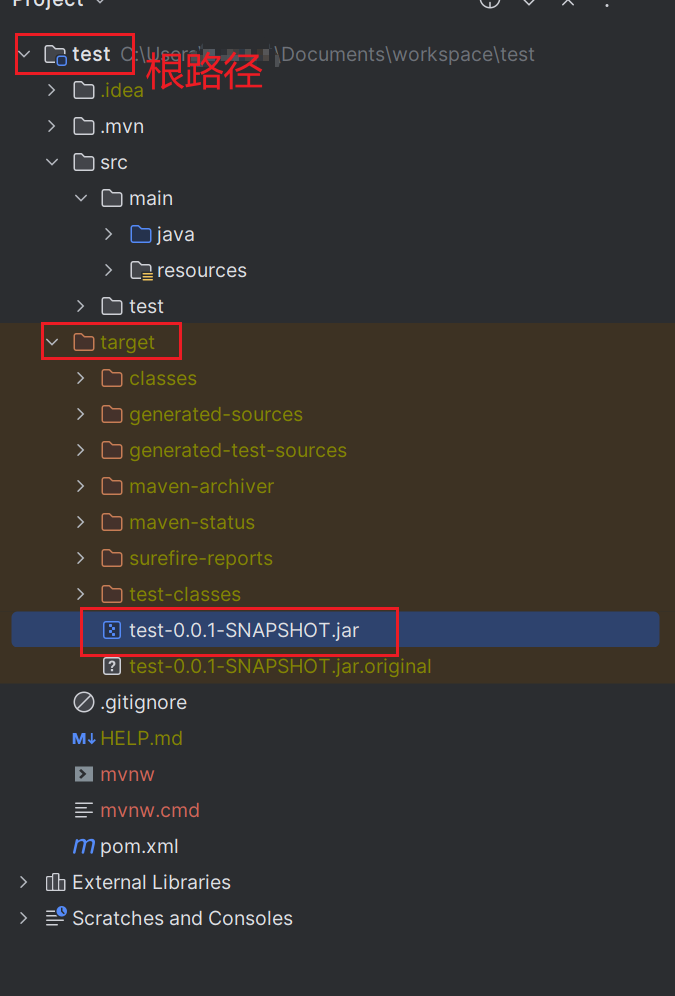

   

### 8. 配置完成，立即构建

   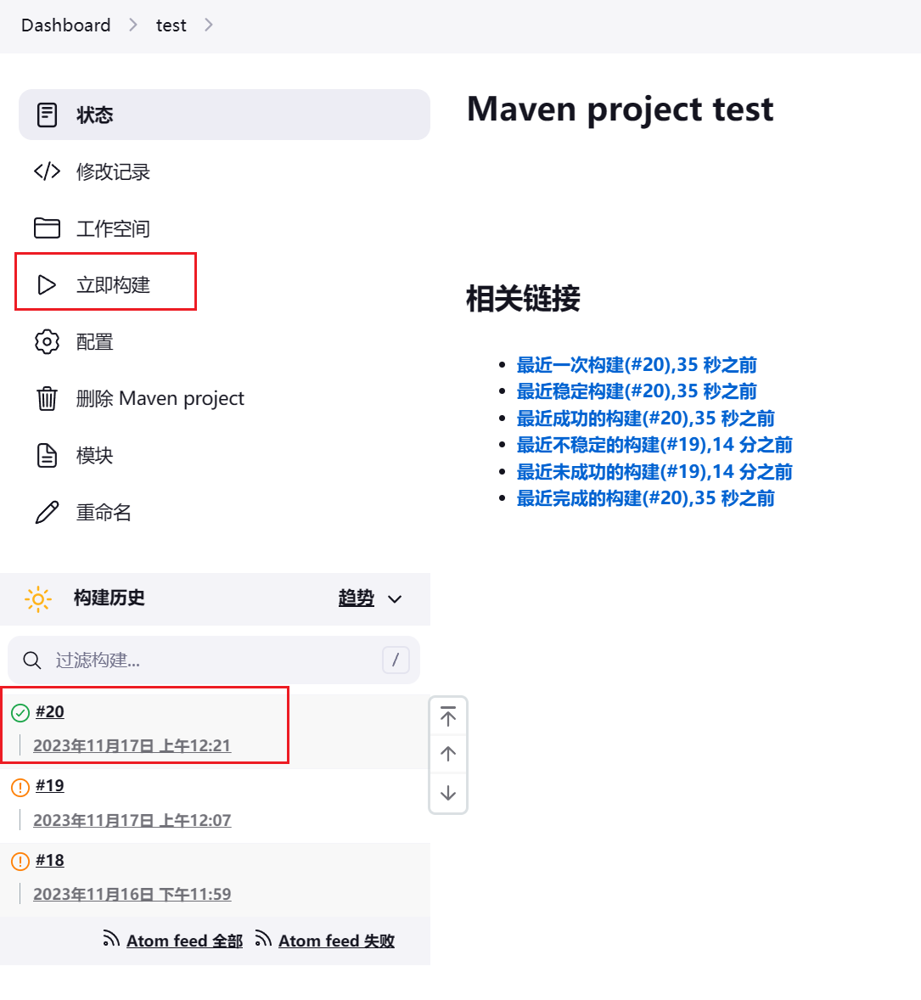

### 9. 查看验证

前往jar包运行的服务器进行测试验证

   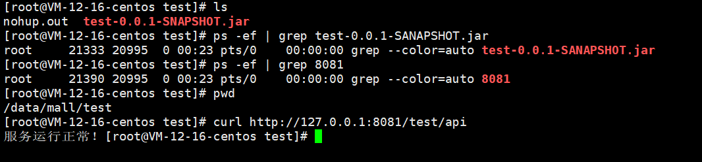

验证自动部署成功！