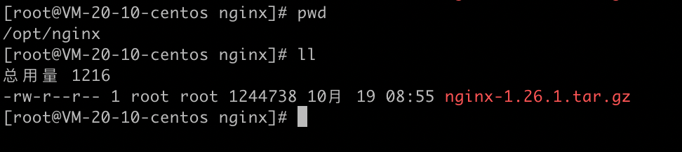
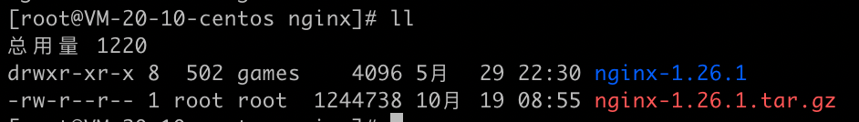
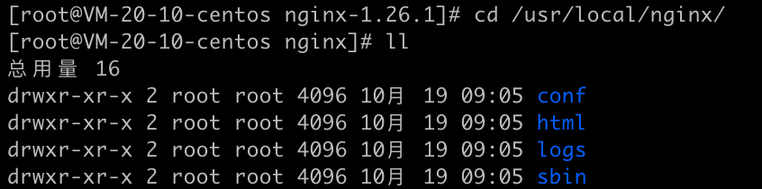
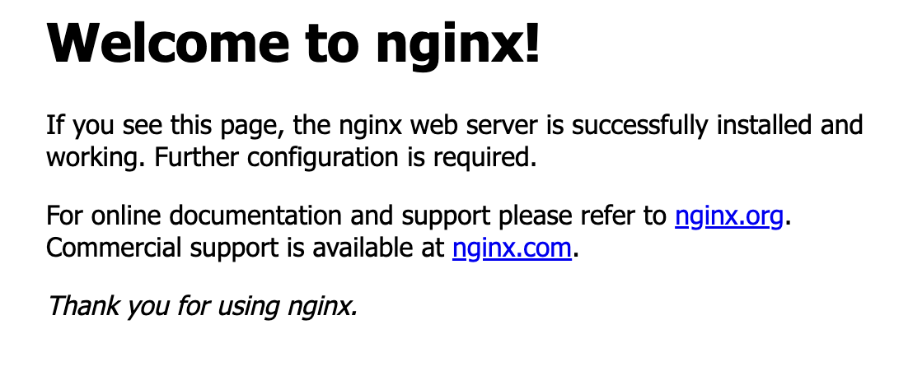
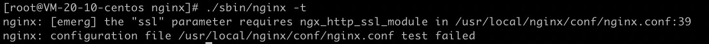

nginx的安装部署详细操作步骤。

<!-- more -->

# CentOS系统Nginx的安装部署

## 安装包准备

在服务器上准备好nginx的安装包

nginx安装包下载地址为：https://nginx.org/en/download.html



解压

```shell
tar -zxvf nginx-1.26.1.tar.gz
```



## 执行命令安装

```shell
# 第一步
cd nginx-1.26.1

# 第二步
./configure

# 第三步
make

# 第四步
make install
```

进入到nginx的安装目录

```shell
cd /usr/local/nginx/
```




## 配置调整验证

验证配置文件nginx.conf是否正常

```shell
./sbin/nginx -t
```

配置文件在/usr/local/nginx/conf/nginx.conf目录下，如有需要可在该配置文件里进行调整。

## 启动运行

启动nginx，命令如下

```shell
./sbin/nginx
```

浏览器访问ip验证

出现如下信息就是nginx部署成功了



## 添加SSL模块

如果有配置ssl证书的需求，还需开启SSL模块，否则校验配置文件时会提示如下信息




### 处理方案

先进入到之前nginx包的解压目录下

```shell
cd /opt/nginx/nginx-1.26.1
```

执行如下命令

```shell
./configure --prefix=/usr/local/nginx --with-http_stub_status_module --with-http_ssl_module
```

然后再运行如下命令

```shell
make
```

替换nginx启动文件（此时需要先保证nginx是关停状态）

```shell
cp /opt/nginx/nginx-1.26.1/objs/nginx /usr/local/nginx/sbin/
```

替换后重新去启动nginx即可