详细介绍下平衡二叉树插入新节点之后，导致了平衡二叉树失衡时，平衡二叉树的自平衡操作流程。以及平衡二叉树删除节点之后，平衡二叉树的自平衡操作流程。

<!-- more -->

# 平衡二叉树

## 1 二叉树

本文主要是介绍平衡二叉树，但是因为涉及到了一些基础的二叉树概念，所以简单介绍下

二叉树的所有节点的左子树节点都小于这个节点，其右子树节点都大于这个节点。

**二叉树的深度：** 深度是任意一个节点到二叉树根节点的距离。（网上存在很多不同的概念，各类文章也是看的人云里雾里，索性按自己想法来，本文里所有地方的根结点深度都算1。）

**二叉树的高度：** 高度是二叉树中任意一个节点到叶子节点的距离。

计算案例如下

| 节点 | 高度计算路径       | 高度 | 深度计算路径       | 深度 |
| ---- | ------------------ | ---- | ------------------ | ---- |
| 0002 | 0002-->0004-->0005 | 3    | 0002               | 1    |
| 0001 | 0001               | 1    | 0001-->0002        | 2    |
| 0004 | 0004-->0005        | 2    | 0004-->0002        | 2    |
| 0003 | 0003               | 1    | 0003-->0004-->0002 | 3    |
| 0005 | 0005               | 1    | 0005-->0004-->0002 | 3    |

## 2 平衡二叉树的概念

> 平衡二叉树的根结点是由构建树的整个过程来决定的，一组同样的数据，插入的顺序不一样，得到的根节点和结果树可能是不一样。

平衡二叉树是一个自平衡的二叉查找树，他维护树的高度是平衡的，对于树中的任意节点，其左右子树的高度差或深度差都不超过1。

这里就引入了一个概念，叫 `平衡因子` ，即一个根节点的左子树深度减去它右子树深度，得到的结果就是这个根节点的 `平衡引子`。

**示例一**

- 叶子节点1、3、5的平衡因子为0。
- 节点2的平衡因子为-1（节点2的左子树深度为2，右子树深度为3）。
- 节点4的平衡因子为0（节点4的左子树深度为2，右子树深度为2）。

平衡二叉树的 `平衡因子` 的 **绝对值** 不能大于1，所以上图就是一个标准的平衡二叉树。

**示例二**

- 叶子节点1、3、6的平衡因子为0。
- 节点2的平衡因子为-2（节点2的左子树深度为2，右子树深度为4）。
- 节点4的平衡因子为-1（节点4的左子树深度为2，右子树深度为3）。
- 节点5的平衡因子为-1（节点4的左子树深度为1，右子树深度为2）。

节点2的 `平衡因子` 的绝对值大于1，所以上图算不上平衡二叉树。

## 3 平衡二叉树的节点插入

插入新节点前是标准平衡二叉树，插入之后，导致其不再是平衡二叉树怎么办呢？

如下图所示，插入前为左，插入后为右。

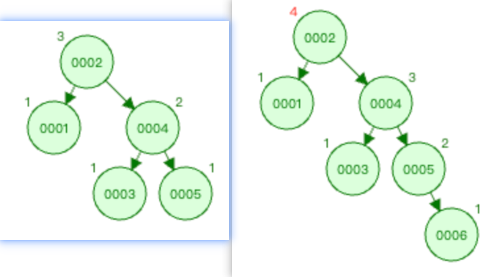

上图所示，在原平衡二叉树的基础上插入一个节点0006，就会破坏这个树的平衡性，根据上文所述的 `平衡因子` 概念可知，上右图里节点0006的加入，破坏了0002节点的平衡性。这种会破坏树平衡性的节点叫 `麻烦节点` ，被破坏平衡性的节点叫做 `被破坏节点` （如果有多个节点的平衡性都被破坏了，也只会称距离插入节点最近的被破坏节点为 `被破坏节点` ）。

破坏平衡性的场景有如下几种，LL型、RR型、LR型、RL型，其中L代表左，R代表右。

从 `被破坏节点` 开始往下判断两次（两个节点之间的路径为一次判断，路径向左即为L，路径向右即为R）即得到破坏平衡性的场景类型。

### 3.1 LL型

#### 3.1.1 示例图

**图1：**

上图1中 `麻烦节点` 为0001，`被破坏节点` 为0004。

在 `被破坏节点` 0004节点的 **左边** （0004-->0003为左）节点（0003节点）的 **左边** (0003-->0001为左)插入新节点0001。

**图2：**

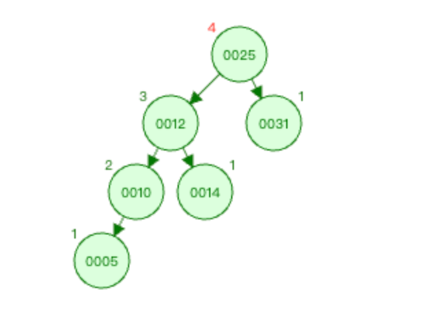

上图2中 `麻烦节点` 为0005，`被破坏节点` 为0025。

在 `被破坏节点` 0025节点的 **左边** （0025-->0012为左）节点（0012节点）的 **左边** (0012-->0010为左)插入新节点0005。

**图3：**

上图3中 `麻烦节点` 为0011，`被破坏节点` 为0025。

在 `被破坏节点` 0025节点的 **左边** （0025-->0012为左）节点（0012节点）的 **左边** (0012-->0010为左)插入新节点0011。

上面三张图所示，在被破坏节点的左边的左边插入新节点，从而导致平衡树失衡了，则称之为LL型。虽然上面图2的0005节点是在0010节点的左边插入，而图3的0011节点是在0010节点的右边插入，但是它们还都算是LL型。因为上文也说过，只会从 `被破坏节点` 开始往下判断两次（第一次为0025-->0012，第二次为0012-->0010），不会理会第三次是往左还是往右。

<u>LL型的解决方案是右旋。</u>

#### 3.1.2 什么是右旋？

在网上看的一个很形象的动态示意图，如下

#### 3.1.3 上图1右旋过程如下

以节点0003为基础进行右旋。

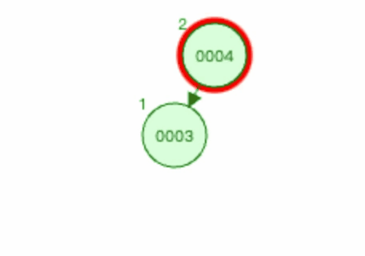

#### 3.1.4 上图2右旋过程如下

以节点0012为基础进行右旋。

#### 3.1.5 上图3右旋过程如下

以节点0012为基础进行右旋。

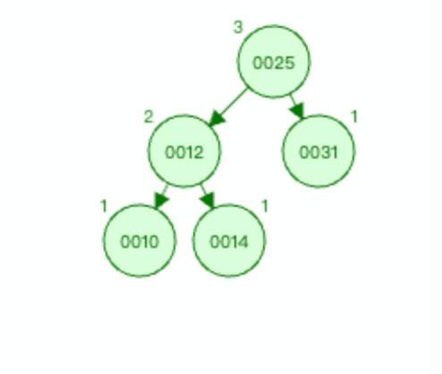

### 3.2 RR型

#### 3.2.1 示例图

**图1：**

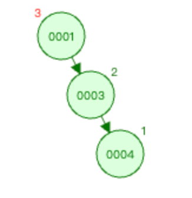

上图中 `麻烦节点` 为0004（新插入节点），`被破坏节点` 为0001。

在 `被破坏节点` 0001节点的 **右边** （0001-->0003为右）节点（0003节点）的 **右边** （0003-->0004为右）插入新节点0004。

**图2：**

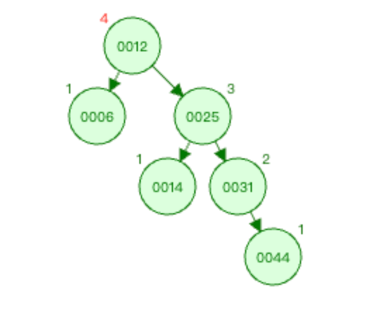

上图中 `麻烦节点` 为0044（新插入节点），`被破坏节点` 为0012。

在 `被破坏节点` 0012节点的 **右边** （0012-->0025为右）节点（0025节点）的 **右边** （0025-->0031为右）插入新节点0044。

**图3：**

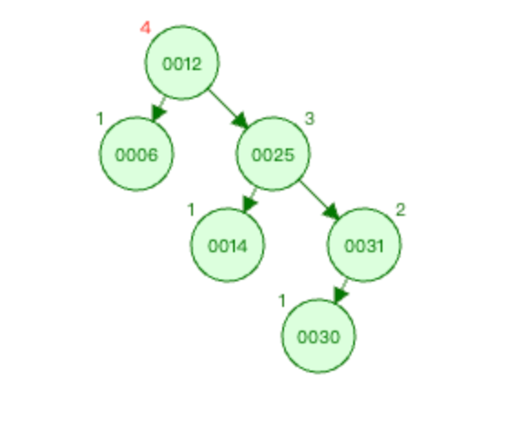

上图中 `麻烦节点` 为0030（新插入节点），`被破坏节点` 为0012。

在 `被破坏节点` 0012节点的 **右边** （0012-->0025为右）节点（0025节点）的 **右边** （0025-->0031为右）插入新节点0044。

上面三张图所示，在被破坏节点的右边的右边插入新节点，从而导致平衡树失衡了，则称之为RR型。虽然上面图2的0044节点是在0031节点的右边插入，而图3的0030节点是在0031节点的左边插入，但是它们还都算是RR型。因为上文也说过，只会从 `被破坏节点` 开始往下判断两次，不会理会第三次是往左还是往右。

<u>RR型的解决方案是 `左旋` 。</u>

#### 3.2.2 什么是左旋？

示意图如下

#### 3.2.3 上图1左旋过程如下

以节点0003为基础进行左旋。

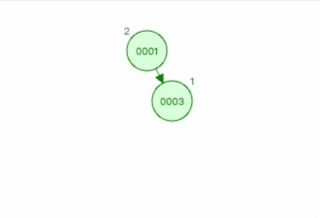

#### 3.2.4 上图2左旋过程如下

以节点0025为基点进行左旋。

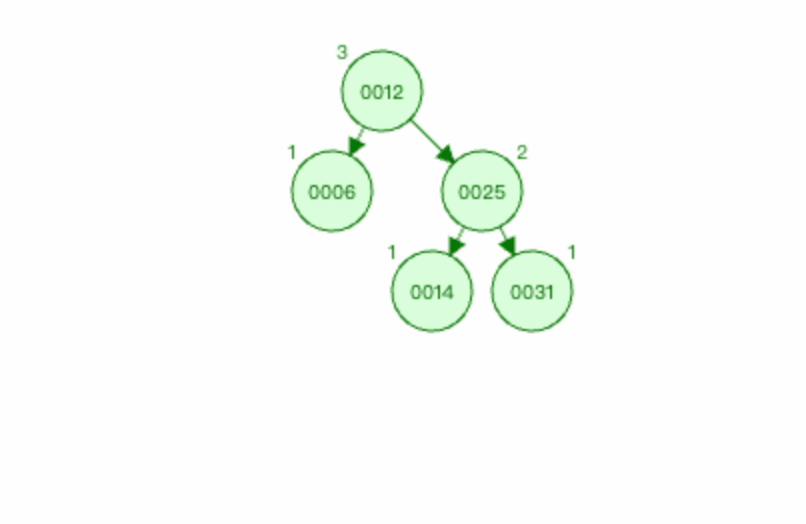

#### 3.2.5 上图3左旋过程如下

以节点0025为基点进行左旋。

### 3.3 LR型

#### 3.3.1 示例图

**图1：**

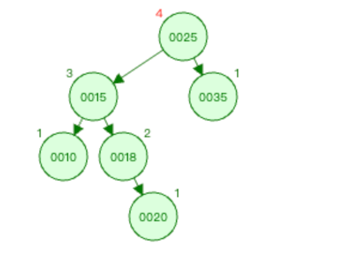

上图1中 `麻烦节点` 为0020（新插入节点），`被破坏节点` 为0025。

在 `被破坏节点` 0025节点的 **左边** （0025-->0015为左）节点（0015节点）的 **右边** (0015-->0018为右)插入新节点0020。

**图2：**

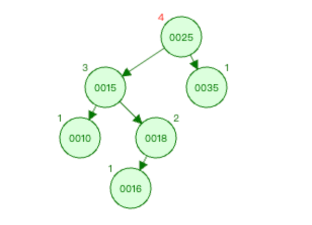

上图1中 `麻烦节点` 为0016（新插入节点），`被破坏节点` 为0025。

在 `被破坏节点` 0025节点的 **左边** （0025-->0015为左）节点（0015节点）的 **右边** (0015-->0018为右)插入新节点0016。

上面两图所示，在被破坏节点的左边的节点的右边插入新节点，从而导致平衡树失衡了，则称之为LR型。

同样此处也只会从 `被破坏节点` 开始往下判断两次，不会理会第三次是往左还是往右。

<u>LR型的解决方案为，先根据 `被破坏节点` 的左子节点为根结点，进行左旋，然后以  `被破坏节点`  为根结点进行右旋。</u>

#### 3.3.2 上图1平衡调整过程如下

1. 先根据 `被破坏节点` 的节点0025 的左子节点0015为根结点，进行左旋操作。

   以0015节点为根结点左旋，则是以0018节点为基础进行左旋。具体操作可参考上文中的RR型操作的左旋。

   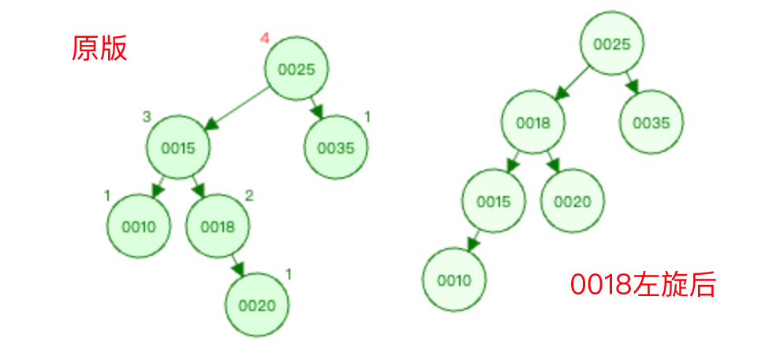

2. 然后以 `被破坏节点` 的节点0025为根结点进行右旋操作。

   以0025节点为根结点进行右旋，则是以节点0018为基础进行右旋操作。

   则 <u>节点0018替换原先的节点0025的位置</u> ，然后 <u>节点0018的左指针指向节点0015</u> ，0025-->0018的路径调整为0018-->0025，<u>节点0025变为节点0018的右子树</u> 。

   那原先节点0018右指针指向的节点0020就被摘了出来，因为是0020比0018大，是0018原先的右子树，所以得放到0018节点的右边去进行比对，先比对0018右子树节点0025，发现0020<0025，则 <u>0020挂到0025节点的左子树节点</u> 即可。

   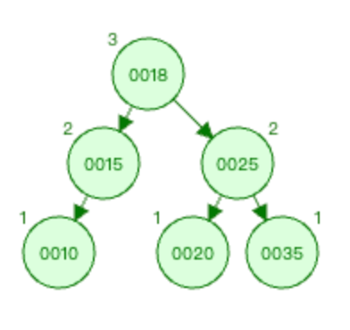

   

#### 3.3.3 上图2平衡调整过程如下

1. 先根据 `被破坏节点` 的节点0025的左子节点0015节点为根结点，进行左旋操作。

   以0015节点为根结点左旋，则是以0018节点为基础进行左旋。

   则 <u>节点0018替换原先的节点0015位置</u> ，然后 <u>节点0018的左指针指向节点0015</u> ，右指针按理应该是指向节点0016的，但是0016小于0018，如果在0018的右边，则不符合二叉树右子树大于其根节点的定义。

   所以将节点0016摘出来，放到节点0018的左边进行比对，然后比对节点0015，发现0016比0015大，则 <u>0016挂到0015节点的右子树</u> 即可。

   此时便完成了以0018节点为基础的左旋操作。

   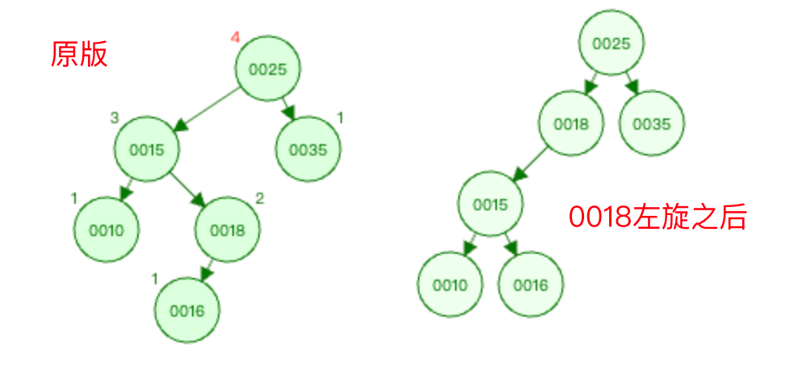

2. 然后再以 `被破坏节点` 的节点0025为根结点进行右旋操作。

   以0025节点为根结点进行右旋，则是以节点0018为基础进行右旋操作。

   则 节点0018替换原先的节点0025位置，0025-->0018的路径调整为0018-->0025，节点0025变为节点0018的右子树。

   此时便完成了整个树的平衡调整操作。

   

### 3.4 RL型

#### 3.4.1 示例图

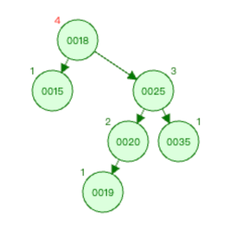

上图中 `麻烦节点` 为0019（新插入节点），`被破坏节点` 为0018。

在 `被破坏节点` 0018节点的 **右边** （0018-->0025为右）节点（0025节点）的 **左边** (0025-->0020为左)插入新节点0019。

因为在被破坏节点的右边的节点的左边插入新节点插入新节点，导致平衡二叉树失衡的为RL型。

RL型的解决方式和LR型的解决思路是一样的。<u>RL型的解决方案为，先根据 `被破坏节点` 的右子节点为根结点，进行右旋，然后以  `被破坏节点`  为根结点进行左旋。</u>

#### 3.4.2 平衡调整过程如下

1. 先根据 `被破坏节点` 的节点0018的右子节点0025节点为根结点，进行右旋操作。

   以0018节点的右子节点为根结点右旋，则是以0020节点为基础进行右旋操作。

   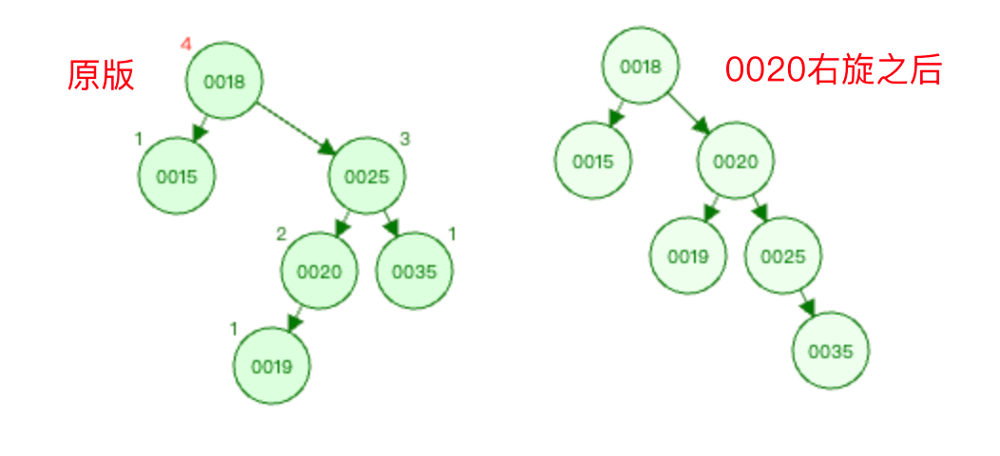

   

2. 然后再以 `被破坏节点` 的节点0018为根结点进行左旋操作。

   以0018节点为根结点左旋，则是以0020节点为基础进行左旋操作。

   则 <u>节点0020替换原先的节点0018位置</u> ，0018-->0020的路径调整为0020-->0018， <u>节点0018变为节点0020的左子树节点</u> ，然后 <u>节点0020的右指针依旧指向节点0025</u> 。

   所以就将节点0019给摘了出来，放到节点0020的左边进行比对，然后比对节点0018，发现0019比0018大，则 <u>0019挂到0018节点的右子树</u> 即可。

   

   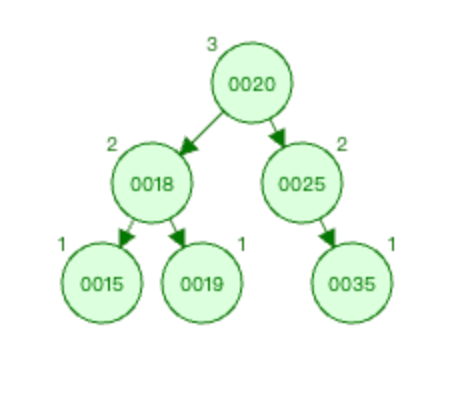

### 3.5 总结说明

由上面这些案例可以总结出如下经验：

- 从 `被破坏节点` 开始往 `麻烦节点` 方向判断两次（两个节点之间的路径为一次判断，路径向左即为L，路径向右即为R）即得到破坏平衡性的场景类型。

- LL型和RR型的处理方式为以 `被破坏节点` 为基础进行其型号相反的方向进行旋转，LL型为右旋，RR型为左旋。
- LR型和RL型都需要进行两次旋转，第一次旋转方向为型号从左到右的首字母，即LR型的第一次旋转，为以 `被破坏节点` 的左子树节点为根结点，进行左旋操作。RL型的第一次旋转，为以 `被破坏节点` 的右子树节点为根结点，进行右旋操作。第二次旋转方向为型号从左到右的结尾字母，即LR型第二次旋转，为以 `被破坏节点` 为根节点进行右旋操作。RL型第二次旋转，为以 `被破坏节点` 为根结点进行左旋操作。

## 4 平衡二叉树的节点删除

### 4.1 LL型

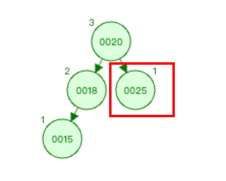

删除节点0025，则会导致节点0020的平衡性被破坏，所以0020节点为 `被破坏节点` 。

删除节点0025之后，可以看到节点0020的左边深度为3（0020-->0018-->0015），右边深度为1（0020）。所以 `平衡因子` 为2，其深度差大于1。

删除节点0025之后的情况如下图

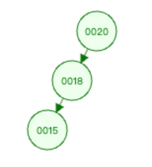

这个图就和0015节点是新插入节点的场景是一样的，可以判断出为LL型的失衡。之后的处理方式也和LL型节点插入一样的，对其进行右旋即可。

### 4.2 RR型

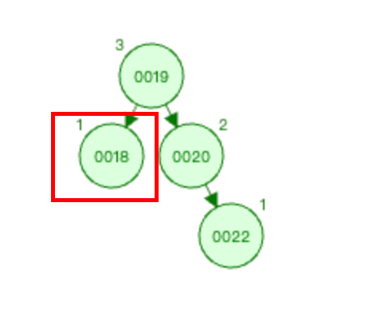

删除节点0018，则会导致节点0019的平衡性被破坏，所以0019节点为 `被破坏节点` 。

删除节点0018之后，可以看到节点0019的左边深度为1（0019），右边深度为3（0019-->0020-->0022）。所以 `平衡因子` 为-2，绝对值为2，其深度差大于1。

删除节点0018之后的情况如下图

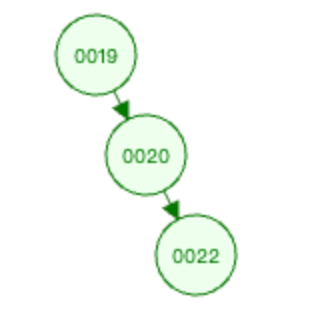

这个图就和0022节点是新插入节点的场景是一样的，可以判断出为RR型的失衡。之后的处理方式也和RR型节点插入一样的，对其进行左旋即可。

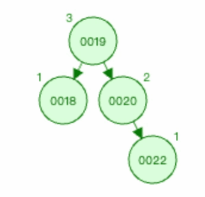

### 4.3 LR型

删除节点0025之后，则会导致节点0020的平衡性被破坏，所以0020节点为 `被破坏节点` 。

删除节点0025之后的情况如下图

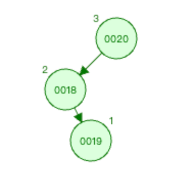

就相当于是0019节点是新插入节点的场景是一样的，可以判断出为LR型的失衡（0020-->0018为左，0018-->0019为右）。之后的处理方式也和LR型节点插入一样的，先根据 `被破坏节点` 的左子节点为根结点，进行左旋，然后以  `被破坏节点`  为根结点进行右旋。

1. 先根据 `被破坏节点` 的节点0020的左子节点0018为根结点，进行左旋操作。

   以0018节点为根结点进行左旋，则是以节点0019为基础进行左旋操作。

   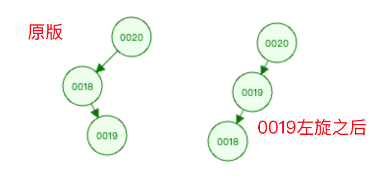

2. 然后以 `被破坏节点` 的节点0020为根结点进行右旋操作。

   以0020节点为根结点进行右旋，则是以节点0019为基础进行右旋操作。

   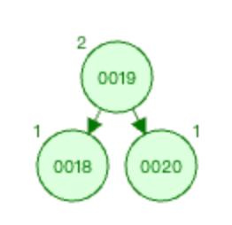

   

### 4.4 RL型

删除节点0019之后，则会导致节点0020的平衡性被破坏，所以0020节点为 `被破坏节点` 。

删除节点0019之后的情况如下图

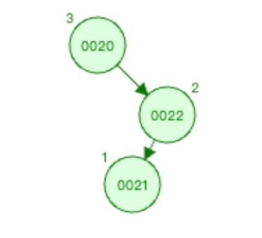

就相当于是0021节点是新插入节点的场景是一样的，可以判断出为RL型的失衡（0020-->0022为右，0022-->0021为左）。之后的处理方式也和RL型节点插入一样的，先根据 `被破坏节点` 的右子节点为根结点，进行右旋，然后以  `被破坏节点`  为根结点进行左旋。

1. 先根据 `被破坏节点` 的节点0020的右子节点0022为根结点，进行右旋操作。

   以0022节点为根结点进行右旋，则是以节点0021为基础进行右旋操作。

   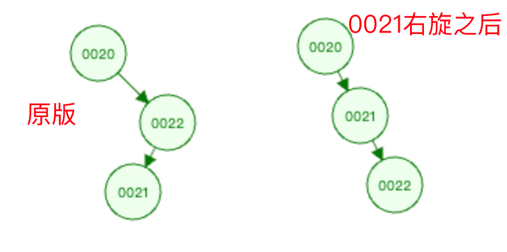

2. 然后以 `被破坏节点` 的节点0020为根结点进行左旋操作。

   以0020节点为根结点进行左旋，则是以节点0021为基础进行左旋操作。

   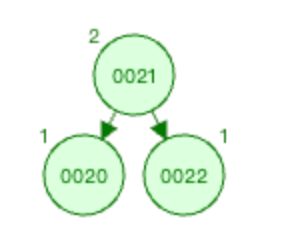

### 4.5 总结说明

平衡二叉树的删除节点之后，其平衡调整操作的思想，基本上和插入节点导致平衡二叉树失衡，而进行平衡调整操作是一样的。
